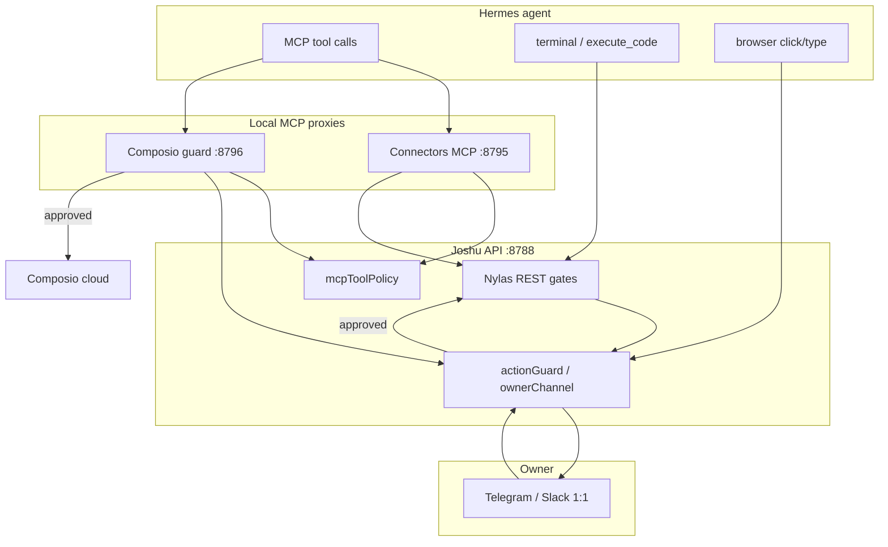

# Agent safety (write policy, HITL, owner channel)

Joshu owns **agent write safety** end-to-end. Composio is OAuth and transport; Hermes is the agent runtime. All enforcement lives in Joshu code, MCP proxies, and REST gates — not in Composio SDK modifiers alone.

**Related docs**

| Topic | Doc |
|-------|-----|
| Safety desktop app (configure policy in UI) | [`safety-settings-arozos-app.md`](safety-settings-arozos-app.md) |
| Connectors UI (owner channel link) | [`connectors-arozos-app.md`](connectors-arozos-app.md) |
| Mail/calendar MCP + cron | [`connectors.md`](connectors.md) |
| Browser HITL (Camofox / noVNC) | [`hitl-camofox-modal-notes.md`](hitl-camofox-modal-notes.md) |

---

## Design principle

1. **Joshu decides** what is blocked, gated, or allowed — deterministically where possible.
2. **Owner channel** is notification + approve/deny ingress only; it does not replace policy.
3. **One HITL gate** — every gated path (`awaitOwnerApproval` in [`gate.ts`](../src/actionGuard/gate.ts)) shares one pending store and one resolve path. Slack reply polling, Telegram callbacks, and signed URL decide links are **ingress only**; they call `resolvePending` — not separate safety systems.
4. **Same gate for every agent path** — Hermes MCP, `execute_code`, `curl`, browser writes, and Composio SDK calls that hit Joshu should converge on the same rules.
5. **Owner human UI bypasses** — jMail compose and owner browser sessions (jWeb / noVNC) are not agent paths.

---

## Three enforcement tiers

| Tier | When | Owner sees | Agent sees on block/deny |
|------|------|------------|--------------------------|
| **1 — Hard block** | Always-on policy (`mcpToolPolicy`) | Nothing (tool never listed or explicit error) | Error: use Nylas send / no delete / no Nylas calendar write |
| **2 — HITL (action guard)** | Enabled + owner channel linked or approval bot configured | Approve / Deny on owner 1:1 (Telegram or Slack) | Success-shaped stub (no side effect) or timeout stub |
| **3 — Soft deny (LLM classifier)** | Optional; ambiguous actions only | Same as tier 2 if escalated to HITL | Classifier may skip gate when below threshold |

Hard blocks run **before** HITL. Example: Composio `GMAIL_SEND_EMAIL` is hard-blocked by MCP policy — it never reaches the approval flow. Agent mail must use `nylas_send_message` (tier 2 when guard is on).

---

## Architecture



| Layer | Port | Role |
|-------|------|------|
| Connectors MCP | `:8795` | Joshu connectors tools; `nylas_send_message` → REST (gate on API) |
| Composio MCP guard | `:8796` | Pass-through to Composio cloud; write tools → `POST …/owner-channel/await` |
| Joshu API | `:8788` | Policy, owner channel, Nylas send gate, webhooks |

When action guard is enabled, Hermes `mcp_servers.composio.url` points at `http://127.0.0.1:8796/mcp`, not Composio cloud directly.

**Code map**

| Area | Path |
|------|------|
| Hard MCP policy | [`src/mcpToolPolicy.ts`](../src/mcpToolPolicy.ts) |
| Action guard core | [`src/actionGuard/`](../src/actionGuard/) |
| Owner 1:1 channel | [`src/ownerChannel/`](../src/ownerChannel/) |
| Composio SDK modifier (direct execute paths) | [`src/composio/modifiers/ownerChannelBeforeExecute.ts`](../src/composio/modifiers/ownerChannelBeforeExecute.ts) |
| Composio MCP guard proxy | [`scripts/composio-mcp-guard-proxy.mjs`](../scripts/composio-mcp-guard-proxy.mjs) |
| Connectors MCP | [`scripts/joshu-connectors-mcp-http-server.mjs`](../scripts/joshu-connectors-mcp-http-server.mjs) |
| Terminal mail bypass block | [`scripts/patch-hermes-terminal-mail-guard.mjs`](../scripts/patch-hermes-terminal-mail-guard.mjs) |
| Browser write gate (Hermes) | [`scripts/patch-hermes-camofox-action-guard.mjs`](../scripts/patch-hermes-camofox-action-guard.mjs) → `POST …/api/action-guard/browser` |
| Browser gate logic | [`src/actionGuard/browserGate.ts`](../src/actionGuard/browserGate.ts) |
| Slack Y/N reply polling | [`src/ownerChannel/slackReplyPoll.ts`](../src/ownerChannel/slackReplyPoll.ts) |
| Safety settings API + UI | [`src/safetySettings/`](../src/safetySettings/), [`apps/safety-settings/`](../apps/safety-settings/) |

---

## Tier 1 — MCP tool policy (hard blocks)

Default **on** when unset. Enforced in Composio guard proxy, Connectors MCP, and Joshu REST (defense in depth).

| Rule | Blocked | Use instead |
|------|---------|-------------|
| Outbound mail via Composio Gmail | `GMAIL_SEND_*`, `GMAIL_REPLY_*`, send heuristics | `mcp_joshu_connectors_nylas_send_message` |
| Nylas calendar writes | `nylas_create_event`, `nylas_update_event`, `nylas_delete_event` | Composio `GOOGLECALENDAR_CREATE_EVENT` |
| Deletes | Composio tools matching `DELETE` / `TRASH` | — (not available to agents) |

Blocked tools are removed from `listTools` where the proxy supports it. Owner **jMail** Gmail send still works (`X-Joshu-Mail-Client: jmail` + same-origin browser).

**Configure:** `JOSHU_MCP_TOOL_POLICY_ENABLED` or **Safety** app → Hard policy → MCP tool policy → writes `mcpToolPolicyEnabled` in `.joshu/action-guard/policy.json`.

API: `GET /joshu/api/mcp-tool-policy`

---

## Tier 2 — Action guard (HITL)

Before an **agent write** that affects third parties, Joshu notifies the owner on the **owner 1:1 channel** with Approve / Deny. Deny and timeout return **success-shaped stubs** so the agent does not retry blindly; no write occurs.

### Gate modes

| Mode | Behavior |
|------|----------|
| **`external_writes`** (default) | Gates Composio write heuristics (`_SEND_`, `_CREATE_`, `_UPDATE_`, `_POST_`, `_REPLY_`), `nylas_send_message`, and browser writes when enabled |
| **`allowlist`** | Skips write heuristics; only actions in `guardedActions` (default includes Nylas send + Gmail send ids — Gmail send is hard-blocked anyway) |

### What is gated vs not

| Path | Gated? |
|------|--------|
| `mcp_joshu_connectors_nylas_send_message` → REST | **Yes** |
| `execute_code` / `curl` → `POST …/nylas/messages/send` | **Yes** (same REST gate) |
| Composio proxy → `GOOGLECALENDAR_CREATE_EVENT`, `SLACK_SEND_MESSAGE`, etc. | **Yes** (`external_writes`) |
| Composio `GMAIL_SEND_EMAIL` | **Hard-blocked** (tier 1) |
| Composio read/meta tools (`COMPOSIO_SEARCH_TOOLS`, list/read) | **No** |
| jMail owner compose | **No** |
| Mail to owner `primaryWorkEmail` only | **No** when `bypassOwnerOnlyRecipients: true` (default) |
| Browser click/type/press | **Yes** when `browserGateWrites: true` (default **off**) |
| Browser navigate/scroll/snapshot | **No** |
| Browser evaluate/submit | Classified as writes; Hermes patch does not hook them yet |

### Browser write gate

When **`browserGateWrites: true`** (Safety app → **Gate browser writes**, or `JOSHU_ACTION_GUARD_BROWSER_GATE=true`), Hermes Camofox **click**, **type**, and **press** call Joshu before executing:

```text
camofox_click / camofox_type / camofox_press
  → POST /joshu/api/action-guard/browser
  → gateBrowserWriteRequest → awaitOwnerApproval (same HITL as mail)
```

**Requirements (all):** action guard enabled, owner channel linked, browser gate on, Hermes `browser_camofox.py` patched (`scripts/apply-hermes-hitl-patch.sh` applies `patch-hermes-camofox-action-guard.mjs`), gateway restarted so `JOSHU_ACTION_GUARD_BROWSER_GATE=true` is in `~/.hermes/.env` (synced from policy on gateway boot).

**Scheduling links:** confirming a Calendly/Google booking is a **`browser:click`** — gated when browser gate is on.

**Not gated:** owner clicking in jWeb/noVNC; agent **navigate** to open a scheduling page (only the confirm click is gated).

**Fail-open:** if Hermes cannot reach Joshu (`POST …/browser` errors), the patch logs a warning and allows the write (same pattern as other Hermes guards).

**Deny/timeout:** Hermes receives a success-shaped browser stub; no click/type/press occurs.

### Enable conditions

Action guard is active when **all** of:

1. `enabled: true` (`JOSHU_ACTION_GUARD_ENABLED` or `policy.json`)
2. Owner channel linked **or** `JOSHU_ACTION_GUARD_TELEGRAM_BOT_TOKEN` set (env or `.joshu/safety-settings/local-env.json`)

If guard is enabled but neither channel nor bot is configured, agent sends return **503** `action_guard_telegram_not_linked` (Joshu stays up).

### MCP timeout vs approval wait

REST and proxy calls **block synchronously** until approve, deny, or policy timeout (default **30 minutes**). Hermes MCP per-tool timeout (~120s) can expire first — workers should `kanban_block(reason="awaiting owner approval")` rather than treat as MCP outage. See [`connectors.md` — Action guard timeout](connectors.md#action-guard--mcp-tool-timeout-vs-approval-wait-2026-06-23).

### Audit

Owner-only audit log: `.joshu/action-guard/audit.jsonl`  
Status: `GET /joshu/api/action-guard/status`

---

## Owner 1:1 channel

Unified channel for **write approvals** (v1). Plain-text owner chat ingress is stubbed for future use.

| Provider | Link | Delivery | Approve / deny |
|----------|------|----------|----------------|
| **Telegram** | `/start` on approval bot, or paste chat ID | Bot API or Composio send | Inline **Approve** / **Deny** buttons |
| **Slack** | Composio Slack OAuth + channel ID (`D…` self-DM, or private channel `C…` e.g. `#patrick-approvals`) | Composio `SLACK_SEND_MESSAGE` (Block Kit — companion avatar + name in message body) | Reply **Y** or **N** in channel (`yes`/`no`/`approve`/`deny` also accepted) |

**Not Hermes Slack chat:** owner-channel Slack uses **Composio** only (approvals). Full agent chat in Slack is a separate Hermes Socket Mode app — configure in **Safety → Hermes Slack chat** ([hermes-integration — Slack chat](hermes-integration.md#slack-chat-hermes-messaging-gateway)).

### Slack approval flow (v1)

1. **`notifyOwnerForApproval`** posts a Block Kit message: companion **avatar + name** context row (`resolveJoshuIdentity`), action id, preview, and “Reply with *Y* or *N*”. Composio does not support per-message `username`/`icon_url` — identity is **in-message** only.
2. While the pending is open, **`attachSlackReplyPollingForPending`** polls conversation history via Composio `SLACK_FETCH_CONVERSATION_HISTORY` (default **8s** interval; **30s** backoff on `ratelimited`).
3. **`parseSlackApprovalReply`** maps the owner’s message → `resolvePending` (same gate as Telegram).
4. **`confirmSlackApprovalDecision`** posts ✅/❌ confirmation (also Block Kit with companion context).

**Fallback:** signed URL links `GET /joshu/api/owner-channel/slack/decide?…` (useful when polling is slow or on VPS — set `JOSHU_OWNER_CHANNEL_PUBLIC_URL` to the public box URL). Interactive Block Kit **buttons** were dropped in v1 (app interactivity not configured); Y/N reply is primary UX.

**Configure**

- **Connectors → Overview → Owner 1:1 channel** (OAuth + link flow)
- **Safety** app → Owner 1:1 channel section (manual chat IDs)
- API: `GET/PUT /joshu/api/connectors/owner-channel`, `POST /joshu/api/owner-channel/await`, `POST /joshu/api/owner-channel/test`
- Test: **Safety → Test approval** or Connectors test — reply Y/N in Slack; polling runs until policy timeout.

**Storage:** `.joshu/owner-channel/owner-channel.json` (migrates legacy `.joshu/action-guard/telegram.json`)

Legacy `JOSHU_ACTION_GUARD_TELEGRAM_*` env vars still work until owner channel is linked.

**Two Telegram bots (do not conflate)**

| Bot | Env | Purpose |
|-----|-----|---------|
| Action-guard / approval | `JOSHU_ACTION_GUARD_TELEGRAM_BOT_TOKEN` | HITL Approve/Deny |
| Hermes 1:1 chat | `TELEGRAM_BOT_TOKEN` | Owner ↔ agent chat (jChat / Telegram gateway) |

**Three Slack integrations (do not conflate)**

| Integration | Config | Purpose |
|-------------|--------|---------|
| Owner approval channel | Connectors + Composio OAuth; channel ID in Safety/Connectors | HITL Y/N only |
| Composio Slack | Connectors OAuth | Agent MCP tools (`SLACK_SEND_MESSAGE`, …) |
| Hermes Slack chat | Safety → `SLACK_BOT_TOKEN` + `SLACK_APP_TOKEN` | Full agent chat (Socket Mode) |

---

## Terminal mail guard

Hermes `terminal` could bypass REST by calling `nylas email send` or `curl …/api/nylas/messages/send` directly.

**Fix:** `scripts/patch-hermes-terminal-mail-guard.mjs` patches Hermes `terminal_tool.py` to hard-block known mail-send shell patterns. Default **on** (`JOSHU_TERMINAL_MAIL_GUARD=1`).

**Configure:** **Safety** app → Terminal mail guard, or env / `.joshu/safety-settings/local-env.json`. Hermes reads the value on gateway dotenv sync (restart gateway after change).

---

## Composio SDK paths (beforeExecute)

Hermes normally uses the **:8796 MCP guard proxy**. Joshu REST routes that call Composio `tools.execute` directly (e.g. some connector helpers) use [`ownerChannelBeforeExecute`](../src/composio/modifiers/ownerChannelBeforeExecute.ts):

1. Hard block via `mcpToolPolicy`
2. If action-guarded → `awaitOwnerApproval`
3. On deny/timeout → throw (no execute)

This keeps SDK and MCP paths aligned without relying on Composio-hosted modifiers.

---

## Bypass defense matrix

| Vector | Mitigation | Residual risk |
|--------|------------|---------------|
| Hermes → connectors MCP → Nylas send | REST gate | — |
| Hermes → Composio MCP → writes | Guard proxy + owner channel | — |
| `execute_code` / `curl` → Joshu Nylas send | REST gate | — |
| Hermes `terminal` → `nylas email send` | Terminal mail guard patch | Custom/obfuscated shell |
| `execute_code` / `curl` → arbitrary external URL | Not gated by Joshu | Egress allowlist (out of scope v1) |
| Composio Gmail send | Hard MCP policy | — |
| Agent delete/trash | Hard MCP policy | — |
| Hermes browser click/type/press | Browser gate + owner channel when `browserGateWrites` | navigate-only; evaluate/submit unhooked; Hermes fail-open if Joshu unreachable |
| jMail owner UI | Client header + same-origin bypass | By design |
| Owner-only recipient mail | `bypassOwnerOnlyRecipients` | By design |

---

## Configuration reference

### Environment variables

| Variable | Purpose |
|----------|---------|
| `JOSHU_MCP_TOOL_POLICY_ENABLED` | Tier 1 hard blocks (default on) |
| `JOSHU_ACTION_GUARD_ENABLED` | Tier 2 master switch |
| `JOSHU_ACTION_GUARD_GATE_MODE` | `external_writes` \| `allowlist` |
| `JOSHU_ACTION_GUARD_BROWSER_GATE` | Gate Camofox writes |
| `JOSHU_ACTION_GUARD_LLM` | Soft classifier for ambiguous actions |
| `JOSHU_ACTION_GUARD_TIMEOUT_MS` | Approval wait (default 30m) |
| `JOSHU_ACTION_GUARD_TELEGRAM_BOT_TOKEN` | Approval bot |
| `JOSHU_ACTION_GUARD_TELEGRAM_ALLOWED_USERS` | Approver user ID allowlist |
| `JOSHU_TERMINAL_MAIL_GUARD` | Terminal mail bypass block (default on) |
| `JOSHU_OWNER_CHANNEL_PROVIDER` | `telegram` \| `slack` |
| `JOSHU_OWNER_CHANNEL_PUBLIC_URL` | Public Joshu base for Slack decide links on VPS |
| `JOSHU_COMPOSIO_SLACK_TOOLKIT_VERSION` | Optional Composio Slack toolkit pin (owner-channel notify) |
| `TELEGRAM_BOT_TOKEN` | Hermes chat bot (separate from approval bot) |
| `SLACK_BOT_TOKEN`, `SLACK_APP_TOKEN` | Hermes Slack chat (Socket Mode) |
| `SLACK_ALLOWED_USERS` | Required allowlist of Slack member IDs (`U…`) for Hermes chat |
| `SLACK_HOME_CHANNEL`, `SLACK_ALLOWED_CHANNELS` | Optional Hermes Slack routing |
| `JOSHU_COMPOSIO_MCP_GUARD_PORT` | Guard proxy port (default 8796) |

See [`.env.example`](../.env.example) for full list.

### On-disk files

| File | Contents |
|------|----------|
| `.joshu/action-guard/policy.json` | Gate mode, timeouts, browser gate, LLM, MCP policy toggle, allowlist |
| `.joshu/owner-channel/owner-channel.json` | Provider, DM targets, Composio account id |
| `.joshu/safety-settings/local-env.json` | Bot tokens, Slack/Telegram messaging, terminal guard when not in `.env` |
| `.joshu/action-guard/audit.jsonl` | Approval audit trail |

**Precedence:** process `.env` overrides UI for keys present at boot. Policy file merges with env for non-env-locked fields.

### REST API summary

| Endpoint | Method | Purpose |
|----------|--------|---------|
| `/joshu/api/safety-settings` | GET/PUT | Read/write all safety settings (Safety app); PUT accepts `restartGateway: true` |
| `/joshu/api/safety-settings/restart-gateway` | POST | Sync messaging env and restart Hermes gateway |
| `/joshu/api/safety-settings/slack-setup` | GET | Hermes Slack setup steps + status |
| `/joshu/api/safety-settings/slack-manifest` | POST | Generate Hermes Slack app manifest |
| `/joshu/api/safety-settings/slack-verify` | POST | Verify Slack bot/app tokens |
| `/joshu/api/safety-settings/test-approval` | POST | Send test approval to owner channel |
| `/joshu/api/action-guard/status` | GET | Guard + Telegram/owner channel status |
| `/joshu/api/connectors/owner-channel` | GET/PUT | Owner channel config (Connectors UI) |
| `/joshu/api/owner-channel/await` | POST | Internal: MCP proxy approval wait |
| `/joshu/api/action-guard/browser` | POST | Internal: Hermes Camofox write gate |
| `/joshu/api/owner-channel/slack/decide` | GET | Signed approve/deny URL fallback (Slack) |
| `/joshu/api/mcp-tool-policy` | GET | Hard policy snapshot for proxies |

---

## Safety desktop app

The **Safety** ArozOS app is the operator UI for tiers 1–2 and owner channel IDs. Full detail: [`safety-settings-arozos-app.md`](safety-settings-arozos-app.md).

Quick start:

```bash
npm run dev:arozos          # builds app + installs desktop shortcut
# or
npm run dev:safety-settings # Vite only on :3010
```

**Troubleshooting:** If the desktop icon does nothing, ensure `arozos/subservice/safety-settings/.startscript` exists and restart `dev:arozos` (ArozOS loads subservices at boot). You should see `[joshu-safety-settings] serving …` in logs.

---

## Operational checklist

1. Enable action guard in **Safety** or env; link owner channel in **Connectors** or paste chat ID in **Safety**.
2. **Telegram:** set approval bot token (env or Safety → Bot tokens). **Slack:** Composio Slack OAuth + channel ID (`C…` or `D…`).
3. Confirm: `curl -fsS http://127.0.0.1:8788/joshu/api/action-guard/status | jq .` → `ownerChannelLinked: true`.
4. Test: **Safety → Test approval** — Telegram buttons or Slack **Y/N** reply.
5. **Browser writes (optional):** enable **Gate browser writes** in Safety; run `scripts/apply-hermes-hitl-patch.sh`; restart Hermes gateway.
6. Verify Composio guard: Hermes config `mcp_servers.composio.url` → `http://127.0.0.1:8796/mcp`.
7. After policy/token/browser-gate/messaging changes affecting Hermes: **Safety → Restart gateway**, or `GET …/hermes-chat/status?after_mcp_boot=1` on VPS.

---

## Out of scope (v1)

- Egress allowlist for `execute_code` / arbitrary `curl`
- Stripping API keys from shell environment
- Full owner ↔ agent chat demux on approval bot (ingress stubbed)
- Composio-hosted `beforeExecute` modifiers (Joshu-owned only)
- Slack Events API / thread replies (polling v1; Events API backlog)
- Slack Block Kit interactive **buttons** (Y/N reply is primary UX; companion identity uses in-message Block Kit context)
- Browser `evaluate` / `submit` Hermes hooks (click/type/press only)
