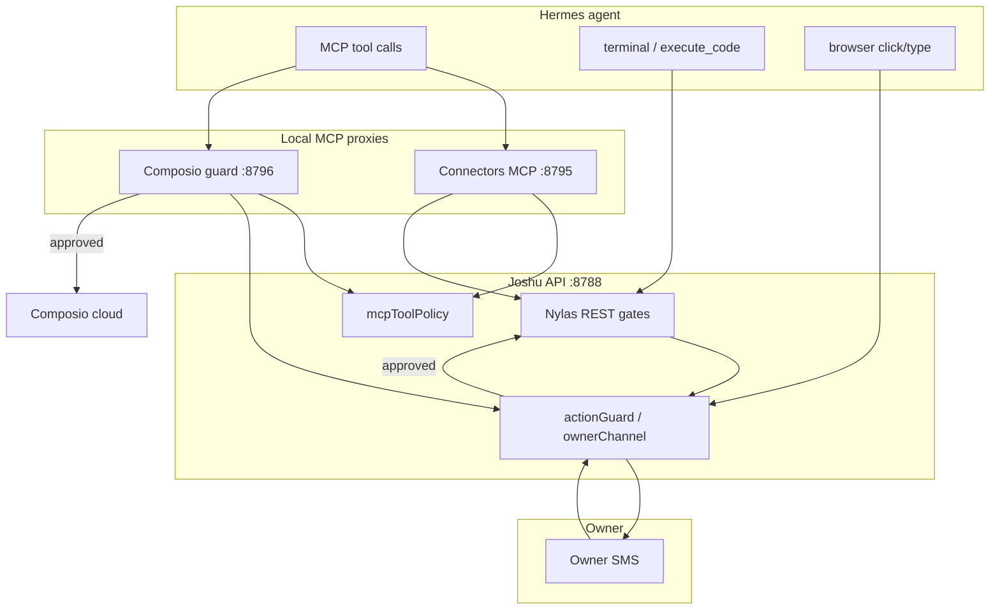

# Agent safety (write policy, HITL, owner channel)

Joshu owns **agent write safety** end-to-end. Composio is OAuth and transport; Hermes is the agent runtime. All enforcement lives in Joshu code, MCP proxies, and REST gates — not in Composio SDK modifiers alone.

**Related docs**

| Topic | Doc |
|-------|-----|
| Safety desktop app (configure policy in UI) | [`safety-settings-arozos-app.md`](safety-settings-arozos-app.md) |
| Safety UI (owner channel, policy) | [`safety-settings-arozos-app.md`](safety-settings-arozos-app.md) |
| Mail/calendar MCP + cron | [`connectors.md`](connectors.md) |
| Browser HITL (Camofox / noVNC) | [`hitl-camofox-notes.md`](hitl-camofox-notes.md) |

---

## Design principle

1. **Joshu decides** what is blocked, gated, or allowed — deterministically where possible.
2. **Owner channel** is notification + approve/deny ingress only; it does not replace policy.
3. **One HITL gate** — every gated path (`awaitOwnerApproval` in [`gate.ts`](../src/actionGuard/gate.ts)) shares one pending store and one resolve path. Inbound SMS Y/N replies via [`smsIngress.ts`](../src/actionGuard/smsIngress.ts) call `resolvePending` — not separate safety systems.
4. **Same gate for every agent path** — Hermes MCP, `execute_code`, `curl`, browser writes, and Composio SDK calls that hit Joshu should converge on the same rules.
5. **Owner human UI bypasses** — jMail compose and owner browser sessions (jWeb / noVNC) are not agent paths.

---

## Three enforcement tiers

| Tier | When | Owner sees | Agent sees on block/deny |
|------|------|------------|--------------------------|
| **1 — Hard block** | Always-on policy (`mcpToolPolicy`) | Nothing (tool never listed or explicit error) | Error: use Nylas send / no delete / no Nylas calendar write |
| **2 — HITL (action guard)** | Enabled + owner SMS configured (Telephone mobile or `TWILIO_OWNER_CALLER`) | Approve / Deny by SMS (reply Y/N) | Success-shaped stub (no side effect) or timeout stub |
| **3 — Soft deny (LLM classifier)** | Optional; ambiguous actions only | Same as tier 2 if escalated to HITL | Classifier may skip gate when below threshold |

Hard blocks run **before** HITL. Example: Composio `GMAIL_SEND_EMAIL` is hard-blocked by MCP policy — it never reaches the approval flow. Agent mail must use `nylas_send_message` (tier 2 when guard is on).

---

## Architecture


```mermaid
flowchart TB
  subgraph agent [Hermes agent]
    MCP[MCP tool calls]
    Term[terminal / execute_code]
    Browser[browser click/type]
  end

  subgraph proxies [Local MCP proxies]
    Conn[Connectors MCP :8795]
    CompGuard[Composio guard :8796]
  end

  subgraph joshu [Joshu API :8788]
    Hard[mcpToolPolicy]
    Gate[actionGuard / ownerChannel]
    REST[Nylas REST gates]
  end

  subgraph owner [Owner]
    SMS[Owner SMS]
  end

  MCP --> Conn
  MCP --> CompGuard
  Conn --> Hard
  Conn --> REST
  CompGuard --> Hard
  CompGuard --> Gate
  REST --> Gate
  Term --> REST
  Browser --> Gate
  Gate --> SMS
  SMS --> Gate
  Gate -->|approved| REST
  CompGuard -->|approved| ComposioCloud[Composio cloud]
```

| Layer | Port | Role |
|-------|------|------|
| Connectors MCP | `:8795` | Joshu connectors tools; `nylas_send_message` → REST (gate on API) |
| Composio MCP guard | `:8796` | Pass-through to Composio cloud; write tools → `POST …/owner-channel/await` |
| Joshu API | `:8788` | Policy, owner channel, Nylas send gate, webhooks |

When action guard is enabled, Hermes `mcp_servers.composio.url` points at `http://127.0.0.1:8796/mcp`, not Composio cloud directly.

**Code map**

| Area | Path |
|------|------|
| Hard MCP policy | [`src/mcpToolPolicy.ts`](../src/mcpToolPolicy.ts) |
| Action guard core | [`src/actionGuard/`](../src/actionGuard/) |
| Owner 1:1 channel | [`src/ownerChannel/`](../src/ownerChannel/) |
| Composio SDK modifier (direct execute paths) | [`src/composio/modifiers/ownerChannelBeforeExecute.ts`](../src/composio/modifiers/ownerChannelBeforeExecute.ts) |
| Composio MCP guard proxy | [`scripts/composio-mcp-guard-proxy.mjs`](../scripts/composio-mcp-guard-proxy.mjs) |
| Connectors MCP | [`scripts/joshu-connectors-mcp-http-server.mjs`](../scripts/joshu-connectors-mcp-http-server.mjs) |
| Terminal mail bypass block | [`scripts/patch-hermes-terminal-mail-guard.mjs`](../scripts/patch-hermes-terminal-mail-guard.mjs) |
| Browser write gate (Hermes) | [`scripts/patch-hermes-camofox-action-guard.mjs`](../scripts/patch-hermes-camofox-action-guard.mjs) → `POST …/api/action-guard/browser` |
| Browser gate logic | [`src/actionGuard/browserGate.ts`](../src/actionGuard/browserGate.ts) |
| SMS approval ingress | [`src/actionGuard/smsIngress.ts`](../src/actionGuard/smsIngress.ts) (via [`twilioSmsGateway.ts`](../src/twilioSmsGateway.ts)) |
| Approval reply parse | [`src/actionGuard/approvalReply.ts`](../src/actionGuard/approvalReply.ts) — short Y/N/`ok` only |
| SMS send (GSM fold + 640-char cap) | [`src/twilioSmsSend.ts`](../src/twilioSmsSend.ts) |
| Safety settings API + UI | [`src/safetySettings/`](../src/safetySettings/), [`apps/safety-settings/`](../apps/safety-settings/) |

---

## Tier 1 — MCP tool policy (hard blocks)

Default **on** when unset. Enforced in Composio guard proxy, Connectors MCP, and Joshu REST (defense in depth).

| Rule | Blocked | Use instead |
|------|---------|-------------|
| Outbound mail via Composio Gmail | `GMAIL_SEND_*`, `GMAIL_REPLY_*`, send heuristics | `mcp_joshu_connectors_nylas_send_message` |
| Nylas calendar writes | `nylas_create_event`, `nylas_update_event`, `nylas_delete_event` | Composio `GOOGLECALENDAR_CREATE_EVENT` |
| Deletes | Composio tools matching `DELETE` / `TRASH` | — (not available to agents) |

Blocked tools are removed from `listTools` where the proxy supports it. Owner **jMail** Gmail send still works (`X-Joshu-Mail-Client: jmail` + same-origin browser).

**Configure:** `JOSHU_MCP_TOOL_POLICY_ENABLED` or **Safety** app → Hard policy → MCP tool policy → writes `mcpToolPolicyEnabled` in `.joshu/action-guard/policy.json`.

API: `GET /joshu/api/mcp-tool-policy`

---

## Tier 2 — Action guard (HITL)

Before an **agent write** that affects third parties, Joshu texts the owner on **SMS** (Telephone owner mobile, or `TWILIO_OWNER_CALLER`) with a Y/N approval prompt. Deny and timeout return **success-shaped stubs** so the agent does not retry blindly; no write occurs.

### Gate modes

| Mode | Behavior |
|------|----------|
| **`external_writes`** (default) | Gates Composio write heuristics (`_SEND_`, `_CREATE_`, `_UPDATE_`, `_POST_`, `_REPLY_`), `nylas_send_message`, and browser writes when enabled |
| **`allowlist`** | Skips write heuristics; only actions in `guardedActions` (default includes Nylas send + Gmail send ids — Gmail send is hard-blocked anyway) |

### What is gated vs not

| Path | Gated? |
|------|--------|
| `mcp_joshu_connectors_nylas_send_message` → REST | **Yes** |
| `execute_code` / `curl` → `POST …/nylas/messages/send` | **Yes** (same REST gate) |
| Composio proxy → `GOOGLECALENDAR_CREATE_EVENT`, `SLACK_SEND_MESSAGE`, etc. | **Yes** (`external_writes`) |
| Composio `GMAIL_SEND_EMAIL` | **Hard-blocked** (tier 1) |
| Composio read/meta tools (`COMPOSIO_SEARCH_TOOLS`, list/read) | **No** |
| jMail owner compose | **No** |
| Mail to owner `primaryWorkEmail` only | **No** when `bypassOwnerOnlyRecipients: true` (default) |
| Browser click/type/press | **Yes** when `browserGateWrites: true` (default **off**) |
| Browser navigate/scroll/snapshot | **No** |
| Browser evaluate/submit | Classified as writes; Hermes patch does not hook them yet |

### Browser write gate

When **`browserGateWrites: true`** (Safety app → **Gate browser writes**, or `JOSHU_ACTION_GUARD_BROWSER_GATE=true`), Hermes Camofox **click**, **type**, and **press** call Joshu before executing:

```text
camofox_click / camofox_type / camofox_press
  → POST /joshu/api/action-guard/browser
  → gateBrowserWriteRequest → awaitOwnerApproval (same HITL as mail)
```

**Requirements (all):** action guard enabled, owner channel linked, browser gate on, Hermes `browser_camofox.py` patched (`scripts/apply-hermes-hitl-patch.sh` applies `patch-hermes-camofox-action-guard.mjs`), gateway restarted so `JOSHU_ACTION_GUARD_BROWSER_GATE=true` is in `~/.hermes/.env` (synced from policy on gateway boot).

**Scheduling links:** confirming a Calendly/Google booking is a **`browser:click`** — gated when browser gate is on.

**Not gated:** owner clicking in jWeb/noVNC; agent **navigate** to open a scheduling page (only the confirm click is gated).

**Fail-open:** if Hermes cannot reach Joshu (`POST …/browser` errors), the patch logs a warning and allows the write (same pattern as other Hermes guards).

**Deny/timeout:** Hermes receives a success-shaped browser stub; no click/type/press occurs.

### Enable conditions

Action guard is active when **all** of:

1. `enabled: true` (`JOSHU_ACTION_GUARD_ENABLED` or `policy.json`)
2. Owner SMS configured (owner mobile in **Telephone** / Welcome, or `TWILIO_OWNER_CALLER`, plus Twilio account/number/webhook — `twilioSmsGatewayEnabled()`)

If guard is enabled but SMS is not configured, agent sends return **503** `owner_channel_sms_not_configured` (Joshu stays up).

### MCP timeout vs approval wait

REST and proxy calls **block synchronously** until approve, deny, or policy timeout (default **30 minutes**). Hermes MCP per-tool timeout (~120s) can expire first — workers should `kanban_block(reason="awaiting owner approval")` rather than treat as MCP outage. See [`connectors.md` — Action guard timeout](connectors.md#action-guard--mcp-tool-timeout-vs-approval-wait-2026-06-23).

### Audit

Owner-only audit log: `.joshu/action-guard/audit.jsonl`  
Status: `GET /joshu/api/action-guard/status`

---

## Owner approval (SMS)

Action-guard write approvals use **owner SMS only** — the same Twilio gateway as owner ↔ Joshu chat.

The owner mobile is captured on the box:

1. **Telephone** → Your mobile (`.joshu/telephone/settings.json` `ownerCaller`)
2. **Welcome** Schedule & email (same file on complete)
3. Fallback: `TWILIO_OWNER_CALLER` in `instance.env` (ops `rotate_secrets`)

| Step | Behavior |
|------|----------|
| Notify | `notifyOwnerForApproval` sends a plain-text SMS summary + “Reply Y to approve or N to deny” |
| Ingress | Inbound SMS on `/api/twilio/sms/inbound` → `handleSmsApprovalIngress` before Hermes chat routing |
| Resolve | Short Y/N (also `yes`/`no`/`ok`/`approve`/`deny`) → `resolvePending` on the newest open pending. Conversational SMS starting with “Ok …” / “Yes …” is **not** an approval. If nothing is pending, the message falls through to Hermes chat. |

**Configure:** Twilio subaccount vars on the box — see [`vps-sandbox/twilio-self-host.md`](vps-sandbox/twilio-self-host.md). Enable action guard in **Safety** or `JOSHU_ACTION_GUARD_ENABLED=1`. Test: **Safety → Test approval** — reply Y or N by SMS. Parser tests: `npm run test:sms-send`.

Approval and chat SMS share [`sendSms`](../src/twilioSmsSend.ts): Unicode is folded to GSM-7 and bodies are capped at **640 characters** so US carriers do not drop the message (Twilio **30019**).

**Not Hermes Slack/Telegram chat:** those remain separate agent chat surfaces in **Safety → Hermes Slack chat** / `TELEGRAM_BOT_TOKEN` ([hermes-integration](hermes-integration.md)).

**Storage:** optional `.joshu/owner-channel/owner-channel.json` for `gateMode` override only. Owner mobile lives in Telephone settings (then `TWILIO_OWNER_CALLER`).

**Slack / Telegram integrations (agent tools & chat — not action guard)**

| Integration | Config | Purpose |
|-------------|--------|---------|
| Composio Slack | Connectors OAuth (`slack`) | Agent MCP tools (`SLACK_SEND_MESSAGE`, …) |
| Hermes Slack chat | Safety → `SLACK_BOT_TOKEN` + `SLACK_APP_TOKEN` | Full agent chat (Socket Mode) |
| Hermes Telegram chat | Safety → `TELEGRAM_BOT_TOKEN` | Owner ↔ agent chat |
| Share-chat Slackbot | Connectors toolkit **`slackbot`** | KB-scoped channel Q&A ([share-chat.md](share-chat.md)) |

---

## Terminal mail guard

Hermes `terminal` could bypass REST by calling `nylas email send` or `curl …/api/nylas/messages/send` directly.

**Fix:** `scripts/patch-hermes-terminal-mail-guard.mjs` patches Hermes `terminal_tool.py` to hard-block known mail-send shell patterns. Default **on** (`JOSHU_TERMINAL_MAIL_GUARD=1`).

**Configure:** **Safety** app → Terminal mail guard, or env / `.joshu/safety-settings/local-env.json`. Hermes reads the value on gateway dotenv sync (restart gateway after change).

---

## Composio SDK paths (beforeExecute)

Hermes normally uses the **:8796 MCP guard proxy**. Joshu REST routes that call Composio `tools.execute` directly (e.g. some connector helpers) use [`ownerChannelBeforeExecute`](../src/composio/modifiers/ownerChannelBeforeExecute.ts):

1. Hard block via `mcpToolPolicy`
2. If action-guarded → `awaitOwnerApproval`
3. On deny/timeout → throw (no execute)

This keeps SDK and MCP paths aligned without relying on Composio-hosted modifiers.

---

## Bypass defense matrix

| Vector | Mitigation | Residual risk |
|--------|------------|---------------|
| Hermes → connectors MCP → Nylas send | REST gate | — |
| Hermes → Composio MCP → writes | Guard proxy + owner channel | — |
| `execute_code` / `curl` → Joshu Nylas send | REST gate | — |
| Hermes `terminal` → `nylas email send` | Terminal mail guard patch | Custom/obfuscated shell |
| `execute_code` / `curl` → arbitrary external URL | Not gated by Joshu | Egress allowlist (out of scope v1) |
| Hermes `mcp_servers` **stdio** (`command` / `args`) | Stripped on gateway sync (`hermesMcpAllowlist.ts`) | Extra **HTTP** MCPs still allowed |
| Public Hermes Admin without basic auth | Caddy omits `hermes-admin` vhost; dashboard does not start | Rotate keys if a box was ever exposed |
| Composio Gmail send | Hard MCP policy | — |
| Agent delete/trash | Hard MCP policy | — |
| Hermes browser click/type/press | Browser gate + owner channel when `browserGateWrites` | navigate-only; evaluate/submit unhooked; Hermes fail-open if Joshu unreachable |
| jMail owner UI | Client header + same-origin bypass | By design |
| Owner-only recipient mail | `bypassOwnerOnlyRecipients` | By design |

---

## Configuration reference

### Environment variables

| Variable | Purpose |
|----------|---------|
| `JOSHU_MCP_TOOL_POLICY_ENABLED` | Tier 1 hard blocks (default on) |
| `JOSHU_ACTION_GUARD_ENABLED` | Tier 2 master switch |
| `JOSHU_ACTION_GUARD_GATE_MODE` | `external_writes` \| `allowlist` |
| `JOSHU_ACTION_GUARD_BROWSER_GATE` | Gate Camofox writes |
| `JOSHU_ACTION_GUARD_LLM` | Soft classifier for ambiguous actions |
| `JOSHU_ACTION_GUARD_TIMEOUT_MS` | Approval wait (default 30m) |
| `TWILIO_ACCOUNT_SID`, `TWILIO_AUTH_TOKEN`, `TWILIO_PHONE_NUMBER`, `TWILIO_SMS_WEBHOOK_URL` | Twilio SMS gateway — see managed fleet A2P runbook (not in OSS) |
| `TWILIO_OWNER_CALLER` | Optional env fallback for owner mobile (Telephone / Welcome preferred) |
| `JOSHU_TERMINAL_MAIL_GUARD` | Terminal mail bypass block (default on) |
| `TELEGRAM_BOT_TOKEN` | Hermes chat bot (separate from action guard) |
| `SLACK_BOT_TOKEN`, `SLACK_APP_TOKEN` | Hermes Slack chat (Socket Mode) |
| `SLACK_ALLOWED_USERS` | Required allowlist of Slack member IDs (`U…`) for Hermes chat |
| `SLACK_HOME_CHANNEL`, `SLACK_ALLOWED_CHANNELS` | Optional Hermes Slack routing |
| `JOSHU_COMPOSIO_MCP_GUARD_PORT` | Guard proxy port (default 8796) |
| `JOSHU_HERMES_DASHBOARD_PASSWORD` | Caddy basic auth for `hermes-admin.*`; empty → vhost and dashboard stay off |

See [`.env.example`](../.env.example) for full list.

### On-disk files

| File | Contents |
|------|----------|
| `.joshu/action-guard/policy.json` | Gate mode, timeouts, browser gate, LLM, MCP policy toggle |
| `.joshu/owner-channel/owner-channel.json` | Optional `gateMode` override (`provider` is always `sms`) |
| `.joshu/safety-settings/local-env.json` | Hermes Slack/Telegram chat tokens, terminal guard when not in `.env` |
| `.joshu/action-guard/audit.jsonl` | Approval audit trail |

**Precedence:** process `.env` overrides UI for keys present at boot. Policy file merges with env for non-env-locked fields.

### REST API summary

| Endpoint | Method | Purpose |
|----------|--------|---------|
| `/joshu/api/safety-settings` | GET/PUT | Read/write all safety settings (Safety app); PUT accepts `restartGateway: true` |
| `/joshu/api/safety-settings/restart-gateway` | POST | Sync messaging env and restart Hermes gateway |
| `/joshu/api/safety-settings/slack-setup` | GET | Hermes Slack setup steps + status |
| `/joshu/api/safety-settings/slack-manifest` | POST | Generate Hermes Slack app manifest |
| `/joshu/api/safety-settings/slack-verify` | POST | Verify Slack bot/app tokens |
| `/joshu/api/safety-settings/test-approval` | POST | Send test approval SMS |
| `/joshu/api/action-guard/status` | GET | Guard + SMS owner-channel status |
| `/joshu/api/connectors/owner-channel` | GET/PUT | Owner channel status (`provider: sms`) |
| `/joshu/api/owner-channel/await` | POST | Internal: MCP proxy approval wait |
| `/joshu/api/action-guard/browser` | POST | Internal: Hermes Camofox write gate |
| `/joshu/api/mcp-tool-policy` | GET | Hard policy snapshot for proxies |

---

## Safety desktop app

The **Safety** ArozOS app is the operator UI for tiers 1–2 and SMS approval status. Full detail: [`safety-settings-arozos-app.md`](safety-settings-arozos-app.md).

Quick start:

```bash
npm run dev:arozos          # builds app + installs desktop shortcut
# or
npm run dev:safety-settings # Vite only on :3010
```

**Troubleshooting:** If the desktop icon does nothing, ensure `arozos/subservice/safety-settings/.startscript` exists and restart `dev:arozos` (ArozOS loads subservices at boot). You should see `[joshu-safety-settings] serving …` in logs.

---

## Operational checklist

1. Enable action guard in **Safety** or env; set owner mobile in **Telephone** (or `TWILIO_OWNER_CALLER`) and Twilio SMS.
2. **Test:** Safety → Test approval — reply Y or N by SMS.
3. Confirm: `curl -fsS http://127.0.0.1:8788/joshu/api/action-guard/status | jq .` → `ownerChannelLinked: true`, `smsConfigured: true`.
4. **Browser writes (optional):** enable **Gate browser writes** in Safety; run `scripts/apply-hermes-hitl-patch.sh`; restart Hermes gateway.
5. Verify Composio guard: Hermes config `mcp_servers.composio.url` → `http://127.0.0.1:8796/mcp`.
6. After policy/browser-gate/messaging changes affecting Hermes: **Safety → Restart gateway**, or `GET …/hermes-chat/status?after_mcp_boot=1` on VPS.

---

## Hermes Admin incident (2026-09)

Fleet incident: **unauthenticated public Hermes Admin** let an attacker add a **stdio MCP dropper** (`lab-beacon-*`) that mined XMR and could read secrets via the dashboard **`env/reveal`** API. Full operator timeline: [troubleshooting — Hermes Admin unauthenticated](vps-sandbox/troubleshooting-and-lessons.md#hermes-admin-unauthenticated-stdio-mcp-miner).

### Attack surface (now mitigated in code)

| Vector | What happened | Mitigation (2026-09-07+) |
|--------|---------------|---------------------------|
| Public `hermes-admin.*` with **empty** `JOSHU_HERMES_DASHBOARD_PASSWORD` | Caddy published the vhost; `header_up Host 127.0.0.1:9119` bypasses Hermes DNS-rebind check | No vhost without bcrypt password; dashboard does not start on fleet boxes |
| **`hermes mcp add --command python3`** (stdio) | RCE + persistence via crontab; miner under `/usr_*vt/…/dns-filter` | **`hermesMcpAllowlist.ts`** strips unknown stdio MCPs on every gateway sync; test: `npm run test:hermes-mcp-allowlist` |
| Dashboard **MCP form** + in-memory registry | Cleaning `config.yaml` alone was insufficient — dashboard respawned the server | Remove MCP from config **and** restart gateway **and** dashboard |
| Dashboard **`env/reveal`** | Leaked OpenRouter, Exa, `API_SERVER_KEY`, Slack tokens, Telegram allow-list | Rotate vendor keys; regenerate Slack at api.slack.com (not CP-mintable) |

### Compromise vs exposure (Sep 2026 fleet scan)

| Status | Boxes |
|--------|--------|
| **Confirmed malware** (miner or `lab-beacon` in logs) | **Patrick**, **Clara** |
| **Exposed** (unauth admin HTTP 200, empty dashboard password; rotate keys as precaution) | Gideon, Tess, Finn, Mina, Joe, Kaelen, Joshua, Cleo, Alex, Debra |
| **Not this campaign** | Owner HTTP MCP **`known_quantity`** (legitimate) |

Best marker on Patrick: dashboard logout **2026-09-06 09:52Z** from **`149.102.245.71`** (Datacamp VPN). Treat that IP as hostile unless confirmed otherwise.

### Post-incident checklist (existing fleet box)

1. **Lock admin:** `bash deploy/scripts/ensure-instance-env-secrets.sh /etc/joshu/instance.env` → recreate **Caddy**; unauth curl must return **401**.
2. **Contain MCP/miner:** strip stdio extras; kill miner; remove `/usr_bwvt`, `/usr_npvf`, `/etc/.dd`; restart gateway + dashboard. Keep `config.yaml.bak-malware-*` as evidence — do not restore.
3. **Rotate secrets:** OpenRouter, Exa, `API_SERVER_KEY` / `HERMES_API_KEY` / `JOSHU_READ_API_KEY` via control-plane `scripts/rotate-exposed-vendor-keys.ts` (see troubleshooting doc). **Slack:** regenerate bot + app tokens in Slack app settings → Safety or `~/.hermes/.env`.
4. **Verify allowlist:** after gateway sync, `mcp_servers` in `config.yaml` must have **no** `command`/`args` stdio entries except Joshu-managed servers.
5. **Dist integrity:** after `rotate_secrets` or `--force-recreate joshu-stack`, host **`/opt/joshu/dist/` must match the release image** — never hotpatch a single `dist/*.js` without syncing the full tree ([hotpatch-running-box.md](vps-sandbox/hotpatch-running-box.md#dist-atomicity-after-secret-rotation-or-recreate)).

### Provision hardening (control plane)

New boxes: CP mints **`JOSHU_HERMES_DASHBOARD_PASSWORD`** in `instance.env` (`sandboxEnv.ts`). See [zero-touch-provisioning.md](https://github.com/db-aeon/joshu-control-plane/blob/main/docs/zero-touch-provisioning.md) in the control-plane repo.

---

## Out of scope (v1)

- Egress allowlist for `execute_code` / arbitrary `curl`
- Stripping extra **HTTP** MCP servers the owner added (stdio is stripped)
- Stripping API keys from shell environment
- Full owner ↔ agent chat demux on approval SMS (chat and approvals share one inbound webhook; Y/N is handled first)
- Composio-hosted `beforeExecute` modifiers (Joshu-owned only)
- Slack Events API / thread replies for approvals (SMS only for HITL)
- Slack Block Kit interactive **buttons** for approvals
- Browser `evaluate` / `submit` Hermes hooks (click/type/press only)
