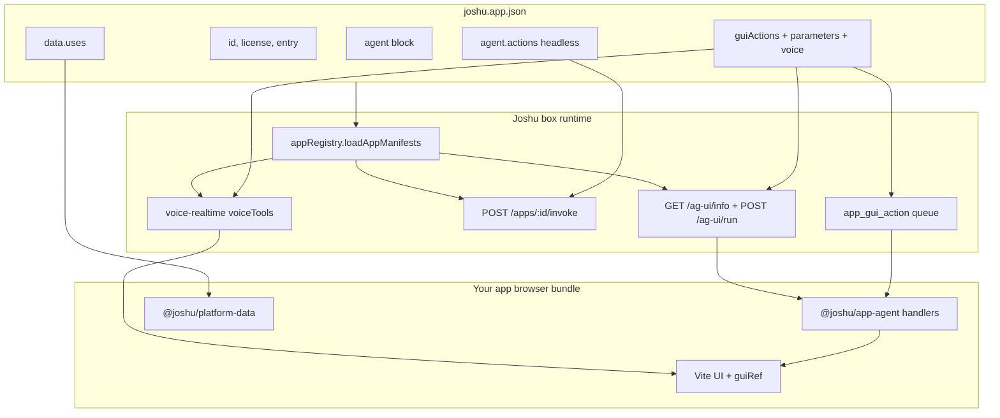

# Joshu App SDK

The **Joshu App SDK** is the manifest contract and validation layer for Joshu desktop apps. It is **not** a UI framework — apps are Vite/React bundles; the SDK defines **`joshu.app.json`** (what your app declares) and **`@joshu/app-sdk`** (how the box validates and derives runtime behavior).

**Related:** [`platform-architecture.md`](platform-architecture.md) · [`platform-data.md`](platform-data.md) · [`app-agent.md`](app-agent.md) (embedded chat) · [`joshu.app.schema.json`](joshu.app.schema.json)

---

## What the SDK does

| Piece | Role |
|-------|------|
| **`joshu.app.json`** | Single manifest per app — identity, licensing, platform data deps, agent integration |
| **`@joshu/app-sdk`** | TypeScript package: validate manifests, resolve voice tools from `guiActions` |
| **`joshu-app validate`** | CLI wrapper around validation (used in CI, sideload, smoke tests) |
| **Joshu server** | Loads manifests from `arozos/subservice/*/joshu.app.json` at runtime |

The manifest is the **contract** between:

- Your **Vite UI** (`apps/<name>/`)
- **Hermes** (skills, `app_gui_action`, headless invoke)
- **AG-UI / CopilotKit** (embedded app chat via `@joshu/app-agent`)
- **Voice-realtime** (Gemini fast tools from `guiActions[].voice`)
- **Platform data** (`@joshu/platform-data` — driven by `data.uses[]`)



---

## Repository layout

```text
apps/my-app/                    # Vite source (dev: npm run dev:my-app)
arozos/subservice/my-app/
  moduleInfo.json               # ArozOS module registry (desktop shell)
  joshu.app.json                # Joshu manifest (this doc)
  start.sh                        # Launch script
  app/                            # Built static assets (dist output)
  skills/                         # Optional: bundled Hermes skills
    my-app-gui/
      SKILL.md
packages/app-sdk/                 # @joshu/app-sdk — validation + voice resolution
```

**Build pipeline**

1. Develop in `apps/<name>/`
2. `npm run build:<name>` → `dist/<name>/`
3. Rsync into `arozos/subservice/<name>/app/` (automatic in `dev:arozos` / image build)
4. Register desktop shortcut in `scripts/lib/arozos-desktop-shortcuts.sh`

---

## `@joshu/app-sdk` package

| | |
|-|-|
| Path | [`packages/app-sdk/`](../packages/app-sdk/) |
| Build | `npm run build` (root) or `npm run build -w @joshu/app-sdk` |
| CLI binary | `joshu-app` → `packages/app-sdk/dist/cli.js` |

### CLI

```bash
node packages/app-sdk/dist/cli.js validate arozos/subservice/jmail/joshu.app.json
# OK arozos/subservice/jmail/joshu.app.json (jmail@0.1.0)
```

`scripts/install-joshu-app.sh` runs this automatically after sideload when the package is built.

### Programmatic API

```typescript
import {
  validateJoshuAppManifest,
  resolveManifestVoiceTools,
  parameterNamesForGuiAction,
  type JoshuAppManifest,
  type JoshuGuiActionDef,
  type ManifestVoiceTool,
} from "@joshu/app-sdk";

const result = validateJoshuAppManifest(JSON.parse(raw));
if (!result.ok) {
  console.error(result.errors);
}

const voiceTools = resolveManifestVoiceTools(
  manifest.agent?.guiActions,
  manifest.agent?.voiceCommands, // legacy fallback
);
// → [{ name: "compose", action: "openCompose", params: ["to","subject","body"], phrases: [...] }]
```

### Exports

| Export | Purpose |
|--------|---------|
| `validateJoshuAppManifest(raw)` | Parse + validate; returns `{ ok, errors, manifest? }` |
| `resolveManifestVoiceTools(guiActions, legacyVoiceCommands?)` | Derive Gemini voice fast tools from manifest |
| `parameterNamesForGuiAction(action)` | List parameter names for one guiAction |
| Types | `JoshuGuiActionDef`, `JoshuGuiActionParameterDef`, `JoshuGuiActionVoiceDef`, `ManifestVoiceTool`, … |

`@joshu/app-agent` re-exports compatible types and duplicates `resolveManifestVoiceTools` for browser bundles (same logic as app-sdk).

The Joshu **server** imports `@joshu/app-sdk` for `resolveManifestVoiceTools` in `src/agUiApi.ts`. Voice-realtime loads tools via `GET /joshu/api/ag-ui/info`.

---

## `joshu.app.json` reference

JSON Schema: [`joshu.app.schema.json`](joshu.app.schema.json).

### Core fields (required)

| Field | Rules | Purpose |
|-------|-------|---------|
| `id` | `^[a-z0-9-]+$` | Stable app id — URLs, invoke path, voice tool prefix |
| `name` | string | Display name (desktop, catalog) |
| `version` | semver string | Bundle version |
| `license` | `AGPL-3.0` \| `MIT` \| `proprietary` | Legal tier — see [APP_STORE.md](APP_STORE.md) |
| `publisher` | string | Publisher slug |
| `entry` | path | HTML entry relative to subservice folder, e.g. `jmail/index.html` |

### Optional core fields

| Field | Purpose |
|-------|---------|
| `apiPrefix` | App-specific Joshu API mount, e.g. `/joshu/api/jmail` |
| `description` | Catalog / About text |
| `publisherId`, `publisherUrl`, `copyright` | Catalog Phase 2 |
| `runtime` | `static` (default), `binary`, `proxy` |
| `minJoshuVersion` | Minimum box stack version |
| `bundleSha256` | Sideload integrity (Phase 2) |
| `pricing` | Store SKU metadata |

### `data` — platform dependencies

Declares which **platform data domains** the app consumes. Use **`@joshu/platform-data`** in UI code — do not call raw connector/gbrain URLs.

```json
{
  "data": {
    "uses": ["mail", "calendar", "files", "memory", "connections"],
    "mail": { "accounts": "any" }
  }
}
```

| `data.uses[]` value | Platform-data surface |
|---------------------|------------------------|
| `mail` | `platform.mail.*` |
| `calendar` | `platform.calendar.*` |
| `files` | `platform.files.*` (gbrain) |
| `memory` | `platform.memory.*` (Hindsight) |
| `connections` | `platform.connections.*` |

Validation rejects unknown `uses` values at manifest validate time.

### `agent` — skills, GUI, voice, headless actions

```json
{
  "agent": {
    "skill": "my-app-gui",
    "usesSkills": ["joshu-mail", "joshu-brain"],
    "headless": false,
    "guiActions": [ /* see below */ ],
    "actions": [ /* headless only */ ]
  }
}
```

| Field | Consumed by | Purpose |
|-------|-------------|---------|
| `skill` | Hermes allowlist, sideload | App-bundled skill name (`skills/<name>/SKILL.md`) |
| `usesSkills` | AG-UI system prompt, Hermes | Platform skills to load (`joshu-mail`, …) |
| `headless` | Prompting | `true` when no desktop window (cron/automation apps) |
| `guiActions[]` | **SSOT** — chat, Hermes, voice | In-app GUI contract (see next section) |
| `actions[]` | Invoke API, MCP codegen | Server-side headless handlers |

**Platform skills** live in `integrations/hermes/skills/`. **App skills** ship in the bundle under `skills/` and install to `$HERMES_HOME/skills/apps/<id>/`.

---

## `guiActions[]` — single source of truth (Option A)

Each guiAction is a **named UI operation** your app implements in the browser. The same name flows through:

1. **CopilotKit** — `useJoshuGuiAction({ name: "openCompose", handler })`
2. **Hermes** — `app_gui_action(appId, action="openCompose", args={...})`
3. **Voice** — optional `voice` block → Gemini tool `app_{appId}_{shortcut}`

### Shape

```json
{
  "name": "openCompose",
  "description": "Open compose pane with optional draft fields",
  "parameters": [
    { "name": "to", "type": "string", "description": "Recipient email" },
    { "name": "subject", "type": "string", "description": "Subject line" },
    { "name": "body", "type": "string", "description": "Message body draft" }
  ],
  "voice": {
    "shortcut": "compose",
    "phrases": ["new email", "compose", "put in the draft", "dictate"]
  }
}
```

| Subfield | Validation | Runtime use |
|----------|------------|-------------|
| `name` | Identifier `[a-zA-Z][a-zA-Z0-9_]*` | `app_gui_action` action name; handler key in app |
| `description` | optional string | Hermes + voice tool description |
| `parameters[]` | unique names, types `string\|number\|boolean\|object` | AG-UI prompt lists `openCompose(to, subject, body)`; voice tool JSON schema |
| `voice.shortcut` | optional identifier; default = `name` | Gemini tool suffix: `app_jmail_compose` |
| `voice.phrases` | non-empty string array | Prompt hints for S2S model |
| `voice.description` | optional | Overrides description on voice tool only |

### Voice tool resolution

`resolveManifestVoiceTools()` builds normalized tools:

```typescript
{
  name: "compose",           // shortcut
  action: "openCompose",   // guiAction name
  params: ["to", "subject", "body"],  // from parameters[]
  phrases: ["new email", "compose", ...],
  description: "Open compose pane..."
}
```

Voice-realtime registers Gemini functions as `app_{appId}_{name}` (e.g. `app_jmail_compose`). On invoke, the server emits `app_action` with `action: "openCompose"` and mapped args — **same handler as chat**.

### Legacy `voiceCommands[]` (deprecated)

Older manifests used a separate array:

```json
"voiceCommands": [
  { "name": "compose", "phrases": ["new email"], "action": "openCompose", "params": ["body"] }
]
```

Still validated (`action` must match a `guiActions[].name`). Merged by `resolveManifestVoiceTools` only when the shortcut name is not already taken by `guiActions[].voice`. **New apps should use `guiActions[].voice` only.**

### End-to-end GUI action flow

```text
User in embedded chat
  → POST /joshu/api/ag-ui/run (state.gui snapshot + CopilotKit tools)
  → Hermes calls app_gui_action(appId, action, args)
  → Plugin enqueues → GET drain on session key joshu-app:{appId}:{threadId}
  → AG-UI SSE CUSTOM app_action → useJoshuGuiAction handler → guiRef

User in voice (fast path)
  → Gemini calls app_{appId}_{shortcut}({ body, ... })
  → voice-realtime app_action wire event
  → onAppAction in app → same guiRef handler

User in voice (think path)
  → Gemini calls think → Hermes full brain
  → app_gui_action → same queue + handlers as chat
```

Session keys, CopilotKit wiring, and GUI snapshot rules: [`app-agent.md`](app-agent.md).

---

## `agent.actions[]` — headless server actions

For operations that do **not** require an open app window (sync, status, cron):

```json
"actions": [
  { "name": "syncMirror", "description": "Sync local mail mirror (cache tier)" },
  { "name": "connectorsStatus", "description": "Connector registry health" }
]
```

| Route | Body |
|-------|------|
| `POST /joshu/api/apps/:appId/invoke` | `{ "action": "syncMirror", "args": { "days": 7 } }` |

Handlers are registered in server code via `registerAppAction(appId, action, handler)` — see [`src/appInvokeApi.ts`](../src/appInvokeApi.ts). Manifest declares **what exists**; TypeScript implements **how it runs**.

`node scripts/generate-app-mcp-tools.mjs` emits MCP stub definitions from all manifests' `agent.actions` for Hermes codegen.

---

## How the server loads manifests

[`src/appRegistry.ts`](../src/appRegistry.ts):

1. On first AG-UI / invoke / validation request, scans `arozos/subservice/*/joshu.app.json`
2. Caches manifests in memory by `id`
3. `getAppManifest(appId)` — used for prompts, `app_gui_action` allowlist, ag-ui/info

[`GET /joshu/api/apps`](../src/appInvokeApi.ts) lists installed apps (id, data, agent summary).

[`GET /joshu/api/ag-ui/info?appId=`](../src/agUiApi.ts) returns agent discovery for embedded chat and voice:

```json
{
  "agents": [{
    "id": "hermes-default",
    "appId": "jmail",
    "guiActions": ["openCompose", "openThread", ...],
    "guiActionDetails": [ /* full guiActions[] from manifest */ ],
    "voiceTools": [ /* resolveManifestVoiceTools() */ ],
    "skills": ["joshu-mail", "jmail-gui"]
  }]
}
```

---

## Developer workflow

### 1. Create manifest

Copy [`arozos/subservice/jmail/joshu.app.json`](../arozos/subservice/jmail/joshu.app.json) or start from schema. Validate early:

```bash
npm run build -w @joshu/app-sdk
node packages/app-sdk/dist/cli.js validate arozos/subservice/my-app/joshu.app.json
```

### 2. Build UI

- Vite app in `apps/my-app/`
- `@joshu/platform-data` for domain I/O (per `data.uses[]`)
- `@joshu/design-system` for in-app tokens

### 3. Optional — embedded agent chat

Follow [`app-agent.md`](app-agent.md#embedded-app-cookbook-any-domain--not-mail-specific):

1. Declare `guiActions[]` with `parameters` (+ `voice` if needed)
2. Implement `guiRef.getGuiSnapshot()` + one handler per guiAction name
3. Bundle `skills/my-app-gui/SKILL.md` from [`docs/templates/my-app-gui-SKILL.md`](templates/my-app-gui-SKILL.md)
4. Wire `JoshuEmbeddedAppAgent` or `JoshuAppAgentProvider` + `useJoshuGuiAction`

**Rule:** handler `name` must **exactly match** manifest `guiActions[].name`.

### 4. Optional — voice

Pass `appId` + `threadId` + `guiSnapshot` to voice session — tools load from ag-ui/info:

```typescript
startJoshuVoiceSession({
  sessionId: "my-app:scope",
  chatSessionId: chatThreadId,
  surface: {
    appId: "my-app",
    threadId: chatThreadId,
    guiSnapshot: guiRef.current?.getGuiSnapshot() ?? {},
  },
  onAppAction: ({ action, args }) => { /* same as useJoshuGuiAction */ },
});
```

No need to pass `voiceCommands` manually when manifest declares `guiActions[].voice`.

### 5. Optional — headless actions

1. Add `agent.actions[]` to manifest
2. Register handler in `registerBuiltInAppActions` or app-specific server module
3. Document in app skill for Hermes (`POST /joshu/api/apps/:id/invoke`)

### 6. Ship

- `npm run build:my-app`
- Sideload: `scripts/install-joshu-app.sh ./my-app-bundle`
- Smoke: `npm run test:platform-architecture`

---

## Validation rules (summary)

`validateJoshuAppManifest` checks:

| Area | Rules |
|------|-------|
| Core | Required fields, `id` pattern, `license` enum |
| `data.uses` | Only `mail`, `calendar`, `files`, `memory`, `connections` |
| `guiActions[]` | Unique names; valid identifiers; parameter types; voice.phrases non-empty when `voice` present |
| `voiceCommands[]` (legacy) | `action` must reference existing guiAction name |
| Voice shortcuts | No duplicate shortcut names across guiActions + legacy |

Validation is **structural** — it does not verify that your TypeScript handlers exist. Use the embedded app checklist in [`app-agent.md`](app-agent.md) for that.

---

## Sideload bundle (`.joshu-app`)

```text
my-app/
  joshu.app.json
  moduleInfo.json
  start.sh
  app/                 # built static assets
  skills/              # optional
    my-app-gui/
      SKILL.md
```

```bash
scripts/install-joshu-app.sh /path/to/bundle-or.zip
```

The installer:

1. Rsyncs to `arozos/subservice/<id>/`
2. Validates manifest via `@joshu/app-sdk`
3. Copies `skills/` → `$HERMES_HOME/skills/apps/<id>/`
4. Registers `agent.skill` in `.joshu/app-skills.json`

Restart `dev:arozos` or refresh desktop shortcuts after install.

---

## Package relationships

| Package | Relationship to app-sdk |
|---------|-------------------------|
| [`@joshu/platform-data`](platform-data.md) | Implements `data.uses[]` — not part of app-sdk, but declared in manifest |
| [`@joshu/app-agent`](app-agent.md) | Consumes `guiActions` in UI; mirrors types; `resolveManifestVoiceTools` for client |
| [`@joshu/voice-client`](../packages/voice-client/) | WebSocket client; surface `appId` only — server resolves voice tools |
| Hermes `joshu-app-gui` plugin | `app_gui_action` tool; validates action names against loaded manifest |

---

## Reference implementation

**jMail** — full manifest v2 with `guiActions` + voice + headless actions:

- Manifest: [`arozos/subservice/jmail/joshu.app.json`](../arozos/subservice/jmail/joshu.app.json)
- App slice: [`apps/jmail/src/mailAppManifest.ts`](../apps/jmail/src/mailAppManifest.ts) (keep in sync with subservice manifest)
- GUI handlers: [`apps/jmail/src/mailGuiActions.ts`](../apps/jmail/src/mailGuiActions.ts)
- Skill: [`arozos/subservice/jmail/skills/jmail-gui/SKILL.md`](../arozos/subservice/jmail/skills/jmail-gui/SKILL.md)
- Doc walkthrough: [`jmail-arozos-app.md`](jmail-arozos-app.md)

---

## Troubleshooting

| Symptom | Check |
|---------|-------|
| `validate` fails on `guiActions` | Identifier names; duplicate params; empty `voice.phrases` |
| Hermes `action not allowed` | Action name not in manifest `guiActions[]`; restart gateway after manifest change |
| Voice tool missing | `guiActions[].voice` declared? `GET /joshu/api/ag-ui/info?appId=` shows `voiceTools`? |
| Chat opens compose, voice does not | Voice fast path uses same handlers — verify `onAppAction` wiring; check voice-realtime logs for `app_jmail_*` |
| Invoke 404 | `agent.actions[]` declared but no `registerAppAction` in server |
| Manifest changes ignored | Restart Joshu (`dev:arozos`); manifests cached per process |

**Smoke test**

```bash
npm run test:platform-architecture
```

Validates app-sdk, manifest load, AG-UI session keys, guiAction queue, and jMail voice tool resolution.

---

## Related docs

- [platform-architecture.md](platform-architecture.md) — three-layer model, invoke + AG-UI overview
- [app-agent.md](app-agent.md) — embedded chat developer guide
- [APP_STORE.md](APP_STORE.md) — distribution, licensing, catalog fields
- [ArozOS subservices](../arozos/subservice/) — installed app tree
