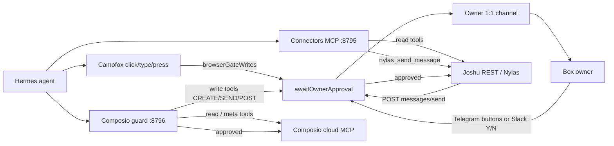

# Deterministic connector apps

> **App developers:** use [`@joshu/platform-data`](platform-data.md) and [`platform-architecture.md`](platform-architecture.md).
> This doc is the **implementation detail** for the mail/calendar platform data plane.

Connector apps sync mail and calendar into **markdown under `joshu's files`**, index via **gbrain**, and expose **human UIs** plus a **thin local MCP** for actions—not for routine mail search.

**Desktop app:** **Connectors** — canonical UI for OAuth (Composio), Gmail account management, and sync health. See [`docs/connectors-arozos-app.md`](connectors-arozos-app.md).

**VPS / multi-box:** Composio OAuth is keyed by `COMPOSIO_USER_ID` (set a unique slug per box). ArozOS login stays `JOSHU_AROZ_USER` (owner email). Without per-slug `COMPOSIO_USER_ID`, every box with the same owner email shares the same Gmail connections in Composio cloud.

**App-wide status:** `GET /joshu/api/connectors/status` returns Nylas + per-Gmail account sync/mirror stats and a `registry` object (also written to `.joshu/connectors-registry.json`). jMail, cron, and Hermes MCP use the same API.

## Layout

```text
joshu's files/connectors/
  mail/nylas/threads/{thread_id}.md           # agent inbox (Nylas)
  mail/gmail/{account_key}/threads/{thread_id}.md   # per Gmail account (Composio)
  calendar/nylas/events/{event_id}.md
  calendar/google/events/{event_id}.md
  _state/nylas-sync.json
  _state/gmail-sync.{account_key}.json
```

Registry (metadata only): `.joshu/connectors-registry.json` — which accounts are connected; OAuth tokens stay in Composio.

Filing guide (EA v2): [`templates/ea/FILING.md`](../templates/ea/FILING.md) (seeded as `${JOSHU_FILES_ROOT}/FILING.md`).

## REST API

| Method | Path | Purpose |
|--------|------|---------|
| GET | `/joshu/api/connectors/status` | Registry + providers + per-account sync/mirror |
| POST | `/joshu/api/connectors/mail/nylas/sync` | Mirror agent inbox |
| GET | `/joshu/api/connectors/mail/nylas/search?q=` | App-local search over mirror |
| POST | `/joshu/api/connectors/mail/gmail/sync` | Mirror Gmail (`{ connectedAccountId? }` — omit = all accounts) |
| GET | `/joshu/api/connectors/mail/gmail/search?q=&connectedAccountId=` | Search Gmail mirror |
| GET | `/joshu/api/connectors/mail/gmail/messages/:id?connectedAccountId=` | Mirror + live body |
| POST | `/joshu/api/connectors/mail/gmail/send` | Send (`connectedAccountId` in body) |
| POST | `/joshu/api/connectors/mail/gmail/reply` | Reply in thread |
| GET | `/joshu/api/connectors/composio/*` | Composio OAuth (see connectors app) |
| GET | `/joshu/api/connectors/cron/jobs` | Joshu scheduler jobs |
| POST | `/joshu/api/connectors/cron/jobs/:id/run` | Run job now |

Gmail tools use Composio toolkit version **`20260506_01`** (override with `JOSHU_COMPOSIO_GMAIL_TOOLKIT_VERSION`). Sync hydrates full thread bodies via `GMAIL_FETCH_MESSAGE_BY_THREAD_ID` with `include_payload` on list fetch.

**Nylas (agent inbox):** sync uses the Nylas **Threads API** (`threads.list` with `newer_than:…`) for discovery and full `message_ids`, then hydrates bodies via paginated `messages.list` scoped to `thread_id` ([`fetchMessagesInThread`](../src/nylas/client.ts), up to **50** messages per thread). Mirrors use the same `###` section layout and frontmatter fields as Gmail (`message_ids`, `thread_messages`, `message_count`).

**Message bodies:** Gmail has no “plaintext only” API — Composio returns MIME (`text/plain` + `text/html`) or sometimes HTML in a top-level `body` field. Joshu prefers MIME `text/plain`, then runs deterministic HTML simplification ([`src/connectors/emailPlaintext.ts`](../src/connectors/emailPlaintext.ts), used by [`gmailBodies.ts`](../src/connectors/composio/gmailBodies.ts)). Nylas HTML bodies use the same simplifier via `stripHtmlToText` in [`mirror.ts`](../src/connectors/mirror.ts). Per-message caps at mirror write: Gmail **8k** chars, Nylas **4k** chars.

**LLM previews** (EA scheduling classifier, Day 0 inference): deterministic code reads the **latest** `###` section in each thread mirror, with optional tail from the prior section ([`src/connectors/mirrorBodyPreview.ts`](../src/connectors/mirrorBodyPreview.ts)) — not a blind slice from the start of the file (oldest message).

Test: `npx tsx scripts/test-email-plaintext.mjs`.

## gbrain indexing and mail search

Connector mirrors are indexed by **gbrain** as page type **`connector-mail`** (path prefix `connectors/mail/`). This is **not** a separate mail search engine — recall uses the same hybrid **`query`** as journals and workspace files.

### How pages are classified

| On-disk path | gbrain type | Notes |
|--------------|-------------|--------|
| `connectors/mail/gmail/…/threads/*.md` | `connector-mail` | Principal Gmail (Composio), per-account subfolder |
| `connectors/mail/nylas/threads/*.md` | `connector-mail` | Agent inbox (Nylas) |
| `connectors/calendar/…/*.md` | `connector-calendar` | Synced events |
| `inbox/*.md` | `inbox` | Human quick capture — **not** synced mail |

Classification is **path-based** (`setup-gbrain-schema.sh`); YAML frontmatter does not need `type: connector-mail`.

### Indexed slugs and searchable content

After Desktop git sync, federated slugs look like:

```text
joshus-files/connectors/mail/gmail/{account_key}/threads/<thread_id>
joshus-files/connectors/mail/nylas/threads/<thread_id>
```

Each file is **one thread**. Search hits include **from**, **subject**, and **plain-text bodies** (per-message `###` sections). Use **`mcp_gbrain_query`** with `source_id: "__all__"`, `recency: "on"`, `since: "90d"`, and mail keywords — see skill [`joshu-mail`](../integrations/hermes/skills/mail/joshu-mail/SKILL.md).

**Two-tier mail search:** (1) **Local cache** — gbrain + mirror markdown on the box (fast). (2) **Deep server-side search** — Composio live Gmail against Google when the cache misses (pre-connect history never mirrored, stale mirrors, or exact subject absent from disk). Composio responses may offload to `/mnt/files/…` in a **remote sandbox** — use `COMPOSIO_REMOTE_WORKBENCH` / `COMPOSIO_REMOTE_BASH`, not local `grep`. Multiple Gmail accounts: scope via `connectedAccountId` from `connectors_status`; `GMAIL_FETCH_EMAILS` uses `user_id: "me"`.

Inspect type: `GET /joshu/api/brain/pages?type=connector-mail`.

Full gbrain doc: [`docs/file-brain.md`](file-brain.md#connector-mail-and-calendar-gbrain).

### Indexing pipeline (automatic)

Mirrors become searchable after **git commit + `sync_brain`** on the Desktop tree (automatic via the gbrain MCP HTTP bridge — no manual git steps). Full trigger table, debounce, and periodic reindex: [`file-brain.md` — Indexing cadence](file-brain.md#indexing-cadence-summary).

Connector cron (`JOSHU_CONNECTORS_CRON=true`, default): Nylas and Gmail **every 10m** (all connected Gmail accounts). Both use **`syncMode: incremental`** on the cron path (Gmail `historyId` + mirror skip; Nylas `newer_than:1d` + skip). Jobs: `.joshu/connectors-cron.json`; implementation: [`src/connectors/scheduler.ts`](../src/connectors/scheduler.ts).

**Gmail OAuth connect** (`POST …/composio/post-connect`) only **seeds** the Gmail `historyId` cursor — it does **not** backfill inbox mail. Historical sync (30 days mail + calendar) runs only via **Day 0** ([`day0-cold-start.md`](day0-cold-start.md)). Manual `POST …/mail/gmail/sync` without `days` is incremental (new mail since connect); pass `"days": 30` for an explicit backfill window.

## Hard factory reset

Connector state spans **local files** and **Composio cloud**:

| What | Where | Hard reset |
|------|-------|------------|
| Mail/calendar mirror markdown | `joshu's files/connectors/` | Deleted (Desktop wipe) |
| Sync cursors | `connectors/_state/*.json` | Deleted |
| Registry snapshot | `.joshu/connectors-registry.json` | Deleted |
| OAuth tokens | Composio cloud (`user_id` = sandbox ArozOS user) | **Disconnected** via Composio API before local wipe |

If only local files are removed (e.g. manual `rm -rf` on Desktop) while Composio accounts stay connected, the **Gmail cron job re-syncs mirrors within ~10 minutes**. Hard factory reset avoids this by running Composio disconnect first.

After hard reset: Connectors shows no connected Gmail accounts; mail mirrors and gbrain `connector-mail` pages stay empty until you connect and sync again. Full procedure: [`docs/box-state.md`](box-state.md#hard-factory-reset).

Manual disconnect without full reset: `npx tsx scripts/box-wipe-connectors.ts` (requires `COMPOSIO_API_KEY` in env).

## Hermes

- **Recall** (find/search mail): load skill **`joshu-mail`** — **local cache** (`mcp_gbrain_query` over indexed `connectors/` mirrors, optional `connectors_sync_now`, disk grep) then **deep server-side** Composio Gmail when cache misses. Not Composio list/search as the first hop.
- **Refresh mirrors:** **`mcp_joshu_connectors_connectors_sync_now`** (`provider: gmail` / `nylas` / `all`), then query again.
- **Actions** (send, live get by id): toolset **`mcp-joshu-connectors`** → `http://127.0.0.1:8795/mcp` (`mcp_servers.joshu_connectors` in `~/.hermes/config.yaml`).
- **Composio MCP**: available when OAuth is connected; mail recall is skill-driven via **`joshu-mail`**; Composio is primary for Slack/GitHub/etc.

### Connectors MCP HTTP (`:8795`)

Thin MCP server: [`scripts/joshu-connectors-mcp-http-server.mjs`](../scripts/joshu-connectors-mcp-http-server.mjs). Started by [`scripts/start-joshu-connectors-mcp.sh`](../scripts/start-joshu-connectors-mcp.sh). **Not** used for mail search — use gbrain `query`.

| Hermes tool name (model / Langfuse) | MCP wire name | REST |
|-------------------------------------|---------------|------|
| `mcp_joshu_connectors_connectors_sync_now` | `connectors_sync_now` | `POST …/connectors/mail/{nylas\|gmail}/sync` |
| `mcp_joshu_connectors_connectors_status` | `connectors_status` | `GET …/connectors/status` |
| `mcp_joshu_connectors_nylas_send_message` | `nylas_send_message` | `POST …/nylas/messages/send` |
| `mcp_joshu_connectors_nylas_get_message` | `nylas_get_message` | `GET …/nylas/messages/:id` |
| `mcp_joshu_connectors_nylas_get_profile` | `nylas_get_profile` | `GET …/nylas/profile` |
| `mcp_joshu_connectors_nylas_update_profile` | `nylas_update_profile` | `POST …/nylas/profile` |
| `mcp_joshu_connectors_google_calendar_find_free_slots` | `google_calendar_find_free_slots` | `GET …/connectors/calendar/google/free-slots` — **live FreeBusy** (`GOOGLECALENDAR_FIND_FREE_SLOTS`). Omit `items` for default multi-calendar scope; response includes **`calendars.combined`** (union busy — use `combined.free` for scheduling) |
| `mcp_joshu_connectors_google_calendar_list_events` | `google_calendar_list_events` | `GET …/connectors/calendar/google/events` — event titles + `blocksAvailability` / transparency (not busy/free) |
| `mcp_joshu_connectors_scheduling_list_meeting_tasks` | `scheduling_list_meeting_tasks` | `GET …/ea/scheduling/meetings` — includes `block_reason` + `recent_comments` per task |
| `mcp_joshu_connectors_scheduling_create_meeting_task` | `scheduling_create_meeting_task` | `POST …/ea/scheduling/meetings` |
| `mcp_joshu_connectors_scheduling_handoff_meeting_task` | `scheduling_handoff_meeting_task` | `POST …/ea/scheduling/meetings/:taskId/handoff` |
| `mcp_joshu_connectors_mail_list_track_tasks` | `mail_list_track_tasks` | `GET …/ea/mail/tracks?projectSlug=` |
| `mcp_joshu_connectors_mail_create_track_task` | `mail_create_track_task` | `POST …/ea/mail/tracks` |
| `mcp_joshu_connectors_mail_handoff_track_task` | `mail_handoff_track_task` | `POST …/ea/mail/tracks/:taskId/handoff` |
| `mcp_joshu_connectors_scheduling_comment_meeting_task` | `scheduling_comment_meeting_task` | `POST …/ea/scheduling/meetings/:taskId/comment` |
| `mcp_joshu_connectors_nylas_list_events` | `nylas_list_events` | `GET …/nylas/events` — agent **ledger** only; not owner availability |
| `mcp_joshu_connectors_nylas_get_event` | `nylas_get_event` | `GET …/nylas/events/:id` |
| `mcp_joshu_connectors_nylas_create_event` | `nylas_create_event` | `POST …/nylas/events` — **`date`, `startLocal`, `endLocal`, `timezone`** or epochs |
| `mcp_joshu_connectors_nylas_update_event` | `nylas_update_event` | `PATCH …/nylas/events/:id` |
| `mcp_joshu_connectors_nylas_delete_event` | `nylas_delete_event` | `DELETE …/nylas/events/:id` |
| `mcp_joshu_connectors_archive_scheduling_stubs` | `archive_scheduling_stubs` | `POST …/ea/triage/archive-stubs` |
| `mcp_joshu_connectors_reconcile_triage_stubs` | `reconcile_triage_stubs` | `POST …/ea/triage/reconcile-stubs` |
| `mcp_joshu_connectors_project_kanban_ensure_board` | `project_kanban_ensure_board` | `POST …/ea/project-kanban/boards` |
| `mcp_joshu_connectors_project_kanban_create_triage_root` | `project_kanban_create_triage_root` | `POST …/ea/project-kanban/triage-root` |

**EA scheduling (v4.19+):** Universal mail ingress → file project, then **`scheduling_*`** child on `ea-scheduling`. Owner availability → **`google_calendar_find_free_slots`** (default: `primary` + personal Gmail calendars; **`calendars.combined.free`**; respects transparent events). Book on owner Google via Composio `GOOGLECALENDAR_CREATE_EVENT`. Cross-board → **`scheduling_*`** / **`mail_*`** MCP (not Hermes `kanban_create`). See [`ea-for-joshu.md`](executive-assistant.md#ea-scheduling--calendar-source-of-truth) and skills [`ea-scheduling`](../integrations/hermes/skills/executive-assistant/ea-scheduling/SKILL.md), [`ea-playbook`](../integrations/hermes/skills/executive-assistant/ea-playbook/SKILL.md).

#### `GET /api/connectors/calendar/google/free-slots`

| Query | Notes |
|-------|-------|
| `date` + `timezone` | One local day (preferred) |
| `timeMin` + `timeMax` | ISO window (alternative) |
| `items` | Optional comma-separated calendar ids. **Omit** for default: `primary` + `personalEmail` + selected Gmail calendars on the connected account |
| `minDurationMinutes` | Filter `free[]` intervals (default 30) |

Response includes per-calendar `busy`/`free` and **`calendars.combined`** (union of busy across all queried calendars). **Use `combined.free` for scheduling slot picks.** Transparent Google events (Show as free) are absent from `busy[]`.

```bash
curl -fsS "http://127.0.0.1:8788/joshu/api/connectors/calendar/google/free-slots?date=2026-06-25&timezone=America/Los_Angeles&minDurationMinutes=15" \
  | jq '{items, combined: .calendars.combined}'
```

**EA project Kanban (2026-06):** User-initiated multi-step / HITL work on boards `project-<slug>` — **not** the `scheduling_*` MCP tools above.

| Context | Preferred tools |
|---------|-----------------|
| **jChat kickoff** (ensure board + triage root) | **`project_kanban_ensure_board`**, **`project_kanban_create_triage_root`** (connectors MCP → Joshu bridge) |
| **Workers / dispatcher** (list, block, complete cards) | Native Hermes **`kanban_*`** when available in the worker toolset |
| **Fallback** (only if MCP missing) | `hermes kanban …` CLI — avoid in jChat when connectors tools are registered |

Outbound steps still go through **`nylas_send_message`** (action guard). Skill: [`ea-project-kanban`](../integrations/hermes/skills/executive-assistant/ea-project-kanban/SKILL.md). Product spec: [`ea-for-joshu.md`](executive-assistant.md#project-kanban-multi-step--hitl-2026-06).

**Tool naming:** Hermes exposes **prefixed** names to the model (`mcp_<server>_<tool>`). On a healthy path it routes to MCP with the **short** name (`nylas_send_message`). Langfuse metadata often shows the prefixed name even when the wire call succeeded. The MCP server also accepts prefixed names (strips `mcp_joshu_connectors_`) for clients that forward the display name verbatim.

**EA summary sends** (morning brief / end of day) use `nylas_send_message` → agent Nylas mailbox only. The Joshu API appends the companion HTML signature automatically. See [`executive-assistant.md`](executive-assistant.md#summary-email).

### Troubleshooting `Unknown tool: mcp_joshu_connectors_*`

Symptom in Langfuse / Hermes traces: `{ "error": "Unknown tool: mcp_joshu_connectors_nylas_send_message" }` (or similar) while **inputs** (`to`, `subject`, `body`) look valid.

**Do not assume bad email args.** The failure is tool dispatch, not Nylas validation.

| Pattern | Likely cause |
|---------|----------------|
| **Intermittent** — same tool worked earlier that day (e.g. morning brief OK, EOD send failed) | Connectors MCP on `:8795` **down or unreachable** for that Hermes session (process exit, stale PID, boot race). Primary hypothesis for “worked once, failed later.” |
| **Always fails** for prefixed names | Client forwarded Hermes display name to MCP without stripping prefix (MCP server now normalizes; image **0.1.13+** or host bind-mount of `joshu-connectors-mcp-http-server.mjs`). |
| **Always fails** even when `curl :8795/health` is OK | Hermes missing `mcp-joshu-connectors` toolset or `mcp_servers.joshu_connectors` in config — run gateway sync / check `~/.hermes/config.yaml`. |

**Diagnose (inside `joshu-stack` container or local dev):**

```bash
curl -fsS http://127.0.0.1:8795/health
cat /root/.joshu/connectors-mcp.pid    # or ~/.joshu locally
tail -50 /root/.joshu/connectors-mcp.log
grep -A4 'joshu_connectors:' /root/.hermes/config.yaml
grep toolsets /root/.hermes/config.yaml   # expect mcp-joshu-connectors
```

**Bypass MCP** (confirm Nylas + Joshu API only):

```bash
curl -s -X POST http://127.0.0.1:8788/joshu/api/nylas/messages/send \
  -H 'Content-Type: application/json' \
  -d '{"to":"…","subject":"smoke","body":"test"}'
```

### Partial MCP catalog (jChat / Telegram)

Hermes registers MCP `tools/list` **once at gateway boot**. If `:8795` / `:8796` are not healthy when the gateway first starts, the gateway keeps a **partial catalog** (often only `nylas_send_message`) until restart — agents may fall back to shell/`curl`/`execute_code`.

**Why boot order matters:** Connectors MCP (`:8795`) calls back to Joshu `:8788`, so Joshu must listen first. That creates a race: Joshu used to warm the Hermes gateway on listen **before** `vps-start.sh` finished starting connectors.

**Mitigation (2026-06):**

| Layer | Behavior |
| ----- | -------- |
| **`vps-start.sh`** | Sets `JOSHU_DEFER_HERMES_GATEWAY_WARM=true`; starts Joshu → connectors MCP → composio guard → `wait_for_mcp_http_health` → nudges `GET …/hermes-chat/status?after_mcp_boot=1` |
| **`src/server.ts`** | When defer env is set, skips gateway warm on listen; starts MCP recovery watchdog only |
| **`src/hermesApi.ts`** | `prepareGatewayAfterMcpBoot()` waits for MCP HTTP health, then starts/restarts gateway; 30s watchdog reloads gateway when connectors recovers |
| **`src/mcpSupervisor.ts`** | Joshu process supervises gbrain/connectors/composio MCP every 30s — restarts dead processes; nudges gateway on recovery (`JOSHU_MCP_SUPERVISOR=false` to disable) |
| **`src/mcpDependencyHealth.ts`** | Shared probes for gbrain `:8794`, connectors `:8795`, composio guard `:8796` |
| **`scripts/joshu-connectors-mcp-http-server.mjs`** | `/health` probes Joshu `GET …/api/instance/version` — reports **503** when Joshu API is down (prevents false-healthy MCP while tools would 404) |
| **`src/instanceHealth.ts`** | `components.connectorsMcp` — box `healthy: false` when `:8795` is down (unless `JOSHU_CONNECTORS_MCP_OPTIONAL=true`) |
| **`scripts/lib/hermes-gateway.sh`** | `nudge_joshu_hermes_gateway` uses `after_mcp_boot=1`; retries up to 3× |

**Local dev (`dev:arozos`):** Connectors MCP starts **before** Joshu in `start_gbrain_if_needed()` — `/health` returns **503** until Joshu listens; gateway watchdog + **`src/mcpSupervisor.ts`** reload when ready.

### Joshu connectors API base (local dev)

Connectors MCP proxies tool calls to Joshu REST via **`JOSHU_CONNECTORS_API_BASE`**. Default: `http://127.0.0.1:8788/joshu` (Joshu private port).

| Misconfiguration | Symptom |
|------------------|---------|
| `JOSHU_CONNECTORS_API_BASE=http://127.0.0.1:8787/joshu` in `~/.hermes/.env` | ArozOS `:8787` returns HTML 404 for `/joshu/api/*`; `:8795/health` may still look alive while every tool fails |
| Joshu not listening on `:8788` | `/health` **503**; supervisor restarts MCP when Joshu recovers |

[`scripts/start-joshu-connectors-mcp.sh`](../scripts/start-joshu-connectors-mcp.sh) warns and rewrites when the base URL contains `:8787`. After fixing, restart connectors MCP and nudge gateway (`GET …/hermes-chat/status?after_mcp_boot=1`).

**Manual fix on a running box:**

```bash
bash scripts/start-joshu-connectors-mcp.sh
curl -fsS http://127.0.0.1:8795/health
curl -fsS --max-time 120 'http://127.0.0.1:8788/joshu/api/hermes-chat/status?after_mcp_boot=1'
```

If tools are still missing, restart the stack or gateway. Open a **new** jChat session or Telegram turn after fix. Nudge `GET /joshu/api/hermes-chat/status?after_mcp_boot=1` and confirm `:8795/health` before starting chat.

## MCP tool policy (hard agent blocks)

> **Canonical doc:** [`agent-safety.md`](agent-safety.md) — tiers, bypass matrix, Safety app, and full configuration reference.

Deterministic routing enforced in **both MCP proxies** and Joshu REST (closes `execute_code` / `curl` bypass). Default **on** (`JOSHU_MCP_TOOL_POLICY_ENABLED` unset = true). Policy source: [`src/mcpToolPolicy.ts`](../src/mcpToolPolicy.ts); proxies load `GET /joshu/api/mcp-tool-policy`.

| Rule | Blocked | Allowed instead |
|------|---------|-----------------|
| Outbound mail | Composio `GMAIL_SEND_*`, `GMAIL_REPLY_*`, and Gmail send heuristics | `mcp_joshu_connectors_nylas_send_message` |
| Calendar create | Connectors `nylas_create_event` (+ update/delete on Nylas calendar) | Composio `GOOGLECALENDAR_CREATE_EVENT` on connected Google account |
| Deletes | Any Composio tool matching `DELETE` / `TRASH` | — (agents cannot delete via MCP) |

Blocked tools are **removed from `listTools`** and return an explicit error on `callTool`. Owner **jMail** Gmail send/reply still works (`X-Joshu-Mail-Client: jmail` + browser `Sec-Fetch-Site`).

Disable for debugging only: `JOSHU_MCP_TOOL_POLICY_ENABLED=false` (restart connectors + Composio guard MCP after change).

## Owner 1:1 channel

> **Canonical doc:** [`agent-safety.md` — Owner 1:1 channel](agent-safety.md#owner-11-channel). Configure in **Connectors → Overview** or the **Safety** desktop app.

Configure in **Connectors → Overview → Owner 1:1 channel**. Stores `.joshu/owner-channel/owner-channel.json` (provider, DM target, optional Composio `connectedAccountId`).

| Provider | Link | Approvals |
|----------|------|-----------|
| **Telegram** | Send `/start` to the action-guard bot, or paste chat ID | Inline Approve/Deny (Bot API or Composio send) |
| **Slack** | Composio Slack OAuth + channel ID (`D…` self-DM or private `C…` e.g. `#my-approvals`) | Markdown prompt; owner replies **Y/N** in channel (polled via Composio). Signed URL decide links as fallback — see [`agent-safety.md` — Slack approval flow](agent-safety.md#slack-approval-flow-v1). |

API: `GET/PUT /joshu/api/connectors/owner-channel`, `POST /joshu/api/owner-channel/await` (MCP proxy), `POST /joshu/api/owner-channel/test`.

Gate stays **Joshu-owned** (`mcpToolPolicy`, MCP proxy, REST gates, browser gate). Owner channel only changes **who receives** approve/deny ingress. Legacy `JOSHU_ACTION_GUARD_TELEGRAM_*` still works until owner channel is linked.

## Action guard (owner approval for writes)

> **Canonical doc:** [`agent-safety.md` — Action guard](agent-safety.md#tier-2--action-guard-hitl). Configure via **Safety** app, env, or `.joshu/action-guard/policy.json`.

Deterministic safeguard: before **agent write** actions that affect third parties (outside the private Joshu↔owner channel), Joshu notifies the box owner on the **owner 1:1 channel** (Telegram or Slack) with Approve / Deny. The agent does not see the gate — deny returns a silent success-shaped response without executing the action.

**Default mode (`gateMode: external_writes`):** gates Composio tools matching write heuristics (`_SEND_`, `_CREATE_`, `_UPDATE_`, `_POST_`, `_REPLY_`), agent Nylas sends, and (when enabled) browser click/type/press. Read/meta tools pass through.

**Scope:** Nylas agent sends are gated on **`POST …/api/nylas/messages/send`** (REST), so Hermes MCP, `execute_code`, and `curl` all hit the same approval flow. Composio writes are gated on the **`:8796` guard proxy**. **jMail** (owner desktop compose) bypasses when the browser sends `X-Joshu-Mail-Client: jmail` with `Sec-Fetch-Site: same-origin`. Mail to owner `primaryWorkEmail` only bypasses when `bypassOwnerOnlyRecipients` is true (default).

**Known bypass (fixed 2026-06-23):** Hermes `terminal` with **`nylas email send`** hit the Nylas CLI directly — bypassing Joshu auth + action guard. Patched via `scripts/patch-hermes-terminal-mail-guard.mjs` (hard block; use `nylas_send_message` MCP). **`execute_code` / `curl`** to arbitrary external URLs may still bypass if not matching blocked patterns.

### Architecture



| Layer | Port | Role |
|-------|------|------|
| Connectors MCP | `:8795` | Thin proxy; `nylas_send_message` → REST (gate on API) |
| Composio MCP guard | `:8796` | Pass-through proxy; Hermes never talks to Composio cloud directly when guard is on |
| Joshu API | `:8788` | **`POST …/nylas/messages/send`** runs action guard; **`POST …/action-guard/browser`** for Camofox writes; owner channel + Slack reply polling |

When guard is enabled, `~/.hermes/config.yaml` sets `mcp_servers.composio.url` to `http://127.0.0.1:8796/mcp` (not the Composio cloud URL). Upstream Composio credentials stay in `.joshu/composio-session.json`; the proxy reads them via localhost-only `GET …/api/connectors/composio/mcp-upstream`.

### What is gated vs not

| Path | Example | Gated? |
|------|---------|--------|
| Hermes → connectors MCP → `nylas_send_message` → REST | Langfuse: `mcp_joshu_connectors_nylas_send_message` | **Yes** (REST gate) |
| Hermes → `execute_code` / `curl` → `POST …/nylas/messages/send` | REST bypass attempt | **Yes** (same REST gate) |
| Hermes → Composio proxy → `GOOGLECALENDAR_CREATE_EVENT` | Calendar booking | **Yes** (`external_writes`) |
| Hermes → Composio proxy → `SLACK_SEND_MESSAGE` | Slack post | **Yes** (`external_writes`) |
| Hermes → Composio proxy → `GMAIL_SEND_EMAIL` | Langfuse: `mcp_composio_GMAIL_SEND_EMAIL` | **Hard-blocked** (MCP policy — use Nylas send) |
| Hermes → Composio proxy → `GMAIL_REPLY_TO_THREAD` | Langfuse: `mcp_composio_GMAIL_REPLY_TO_THREAD` | **Hard-blocked** (MCP policy) |
| Hermes → Composio proxy → meta/read tools | `mcp_composio_COMPOSIO_SEARCH_TOOLS`, `COMPOSIO_MANAGE_CONNECTIONS`, Gmail list/read | **No** — pass-through |
| Hermes → browser → click/type/press | Scheduling confirm, form submit | **Yes** when `browserGateWrites: true` (default off) — see [`agent-safety.md` — Browser write gate](agent-safety.md#browser-write-gate) |
| Hermes → connectors MCP → read tools | `mcp_joshu_connectors_connectors_status`, `nylas_get_message`, sync | **No** |
| **jMail** → `POST …/nylas/messages/send` | Owner composing in desktop app (`X-Joshu-Mail-Client: jmail` + browser `Sec-Fetch-Site`) | **No** — owner UI |
| EA cron summary → owner `primaryWorkEmail` only | Morning brief / EOD | **No** when `bypassOwnerOnlyRecipients` is true (default) |

Policy: default `gateMode` is **`external_writes`**. Use **`allowlist`** to gate only explicit action ids. Expand via `.joshu/action-guard/policy.json` or env (`JOSHU_ACTION_GUARD_GATE_MODE`).

### Langfuse / Hermes tool naming

Hermes exposes **prefixed** names to the model; MCP servers use **short** wire names:

```text
mcp_<server>_<wire_tool>
```

| Langfuse name (model) | MCP server | Wire name | Typical role |
|-----------------------|------------|-----------|--------------|
| `mcp_joshu_connectors_nylas_send_message` | `joshu_connectors` | `nylas_send_message` | Agent Nylas send (**gated**) |
| `mcp_joshu_connectors_connectors_status` | `joshu_connectors` | `connectors_status` | Sync health (read) |
| `mcp_composio_GMAIL_SEND_EMAIL` | `composio` | `GMAIL_SEND_EMAIL` | Owner Gmail send via Composio (**gated**) |
| `mcp_composio_COMPOSIO_SEARCH_TOOLS` | `composio` | `COMPOSIO_SEARCH_TOOLS` | Tool discovery (read — **not gated**) |

**Not every `mcp_composio_*` call is gated.** Meta/read tools pass through. In `external_writes` mode, Composio **write** tools (calendar create, Slack send, GitHub create, etc.) trigger owner approval. Principal Gmail send remains **hard-blocked** — agents use **`mcp_joshu_connectors_nylas_send_message`** (connectors path, gated on REST).

Connectors MCP strips the `mcp_joshu_connectors_` prefix when normalizing tool names (see [Tool naming](#tool-naming) above).

### Enable

```bash
JOSHU_ACTION_GUARD_ENABLED=true
JOSHU_ACTION_GUARD_TELEGRAM_BOT_TOKEN=…   # BotFather token
# optional:
JOSHU_ACTION_GUARD_GATE_MODE=external_writes   # or allowlist
JOSHU_ACTION_GUARD_BROWSER_GATE=true           # gate browser click/type/press (Hermes patch + gateway restart)
JOSHU_ACTION_GUARD_LLM=true                    # soft classifier for ambiguous actions
```

Example `.joshu/action-guard/policy.json`:

```json
{
  "enabled": true,
  "gateMode": "external_writes",
  "bypassOwnerOnlyRecipients": true,
  "browserGateWrites": false,
  "llmClassifier": false,
  "llmClassifierThreshold": 0.7
}
```

Optional policy file: `.joshu/action-guard/policy.json` (merged with env). Requires **both** `enabled` and bot token for `isActionGuardEnabled`.

**Link Telegram:** owner sends **`/start`** to the **action-guard** bot once. Confirm: `GET /joshu/api/action-guard/status` → `"telegramLinked": true`. Welcome `communicationContacts.telegram` is used as a username hint only. If guard is enabled but Telegram is not linked, agent sends return **503** `action_guard_telegram_not_linked` (Joshu stays up — does not crash).

**Allowlist (recommended):** set numeric Telegram user IDs so only the owner can link or tap Approve/Deny:

```bash
JOSHU_ACTION_GUARD_TELEGRAM_ALLOWED_USERS=123456789   # comma-separated
```

Or `.joshu/action-guard/policy.json`: `"telegramAllowedUserIds": [123456789]`. Env wins when set. When the allowlist is **empty**, legacy behavior allows anyone who finds the bot to `/start` (last link wins). Status: `telegramAllowlistConfigured` / `telegramAllowlistCount` on `GET …/action-guard/status`.

**1:1 chat** uses a **separate** Hermes messaging bot (`TELEGRAM_BOT_TOKEN` + `TELEGRAM_ALLOWED_USERS` in `/etc/joshu/instance.env` or `~/.hermes/.env`) — not the action-guard token. Joshu syncs `TELEGRAM_*` into `~/.hermes/.env` on gateway start. Setup: [hermes-integration — Telegram 1:1](hermes-integration.md#telegram-11-chat-hermes-messaging-gateway). Same Hermes gateway process as jChat; different platform adapter and session key.

**Deny / timeout:** Agent receives `{ ok: true, messageId: "blocked-…" }` (Nylas) or Composio `{ successful: true, … }` — no mail is sent. Default timeout: 30 minutes (`approvalTimeoutMs` / `JOSHU_ACTION_GUARD_TIMEOUT_MS`).

### Action guard — MCP tool timeout vs approval wait (2026-06-23)

When action guard is enabled, **`POST …/nylas/messages/send`** blocks synchronously until the owner approves, denies, or the **30-minute** policy timeout ([`src/actionGuard/gate.ts`](../src/actionGuard/gate.ts)).

Hermes agents call sends via **`mcp_joshu_connectors_nylas_send_message`**, which proxies to that REST endpoint. The MCP client often applies a **per-tool call timeout (~120s)** independent of Joshu’s approval window.

| What you see | What it usually means | Wrong diagnosis |
|--------------|----------------------|-----------------|
| Langfuse: `TimeoutError` / tool failed at ~120s on `nylas_send_message` | Owner has not approved yet (or approval prompt still open) | “MCP down” / “connectors unreachable” |
| `:8795/health` OK, `connectors_status` OK | Connectors MCP is fine — gate is waiting | Restart MCP |
| `{ ok: true, messageId: "blocked-…" }` | Owner denied or Joshu approval timed out at 30 min | Mail was sent |
| `503` + `action_guard_telegram_not_linked` | Owner channel not linked — Joshu returns unavailable (does not crash) | MCP failure |

**Hermes `connect_timeout: 1800`** in `~/.hermes/config.yaml` (when guard is on) only extends **MCP connection establishment** — not the per-invocation tool timeout inside Hermes.

**Worker behavior:** [`ea-scheduling` v4.19+](../integrations/hermes/skills/executive-assistant/ea-scheduling/SKILL.md) and [`ea-playbook` v2.16+](../integrations/hermes/skills/executive-assistant/ea-playbook/SKILL.md): on send timeout with guard enabled → **`kanban_block(reason="awaiting owner approval")`**, not `connectors-mcp-down`. After **denied** send (`decision: denied` in action-guard audit, or `blocked-*` messageId), use [ops retry](../executive-assistant.md#ea-scheduling--ops-retry-denied-send--bad-slots) — do not treat kanban comment "sent availability" as mail delivered.

**Future fix (backlog):** async approval — REST returns `{ status: "pending_approval", pendingId }` immediately; worker blocks on Kanban until Joshu completes send after Telegram approve. See [`ea-skill-future-fixes.md`](executive-assistant.md).

**Disable:** `JOSHU_ACTION_GUARD_ENABLED=false` or `"enabled": false` in policy — Composio MCP reverts to direct cloud URL on next gateway sync (`POST …/connectors/composio/sync` with `restartGateway: true`).

**Status / audit:** `GET /joshu/api/action-guard/status`. Owner-only audit: `.joshu/action-guard/audit.jsonl`.

**Boot:** `scripts/start-composio-mcp-guard.sh` (local dev via `dev-arozos`; VPS via `vps-start.sh` + 60s watchdog). Bind-mounts in `deploy/docker-compose.yml` for `composio-mcp-guard-proxy.mjs` and `start-composio-mcp-guard.sh`. Hermes `connect_timeout` for connectors + composio MCP is **1800s** when guard is active (owner approval window).

### Testing

| Goal | How |
|------|-----|
| Test approval loop (mail) | **jChat / Hermes** — ask agent to send from agent mailbox (`mcp_joshu_connectors_nylas_send_message` or REST — same gate) |
| Test Slack Y/N | **Safety → Test approval** with Slack owner channel — reply Y or N in the channel |
| Test browser gate | Enable **Gate browser writes**; restart Hermes; ask agent to click a link in Camofox — should prompt owner before click |
| Confirm REST bypass closed | Agent `execute_code` / `curl` to `POST …/nylas/messages/send` must **also** prompt owner (not send silently) |
| Confirm gate is off for owner | **jMail** send — should **not** prompt when browser sends `X-Joshu-Mail-Client: jmail` + `Sec-Fetch-Site` |
| Confirm owner channel linked | `curl -fsS …/joshu/api/action-guard/status \| jq '.ownerChannelLinked, .ownerChannel'` |
| Confirm Composio proxy | `curl -fsS http://127.0.0.1:8796/health` on box; Hermes config `mcp_servers.composio.url` → `:8796/mcp` |
| Classify fixtures | `node scripts/test-action-guard-classify.mjs` |
| Update a running VPS | Rebuild and redeploy the Docker image from this repo (`npm run vps:build-image`) or `git pull` + `docker compose up -d --build` on the host |

Example agent prompt: *“Send an email to db@example.com with subject ‘Action guard test’ and body ‘Testing approval gate.’”* Expect Telegram before send; Langfuse trace shows `mcp_composio_COMPOSIO_SEARCH_TOOLS` (ungated) then `mcp_joshu_connectors_nylas_send_message` (gated).

## Cron (no Hermes gateway)

`JOSHU_CONNECTORS_CRON` defaults to `true`. Jobs live in `.joshu/connectors-cron.json` (defaults: Nylas and Gmail every **10m** — syncs **all** connected Gmail accounts, incremental mode).

## Boot

Local `npm run dev:arozos` starts the connectors MCP via `scripts/start-joshu-connectors-mcp.sh` and the Composio guard proxy via `scripts/start-composio-mcp-guard.sh` when Composio or action guard is configured. Hermes config is updated when the gateway syncs (`mcp_servers.joshu_connectors`, `mcp_servers.composio`).

**VPS:** `deploy/scripts/vps-start.sh` starts connectors MCP after Joshu API is up, then a **60s watchdog** restarts it when `http://127.0.0.1:8795/health` fails. `deploy/docker-compose.yml` bind-mounts `joshu-connectors-mcp-http-server.mjs` and `start-joshu-connectors-mcp.sh` from the host `/opt/joshu` checkout (same hotfix pattern as gbrain boot scripts). After `git pull`, recreate `joshu-stack` so mounts and watchdog apply.
