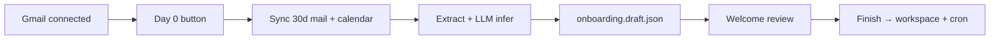

# Day 0 cold start

Deterministic **Day 0** pipeline: after Gmail is connected, sync 30 days of mail + calendar, infer Welcome onboarding fields with a cheap LLM, and pre-fill `.joshu/onboarding.draft.json` for human review.

Day 0 does **not** complete Welcome, write workspace files, or install EA cron jobs — that stays [`completeOnboarding`](../src/onboarding/workspaceWriter.ts) on **Finish setup**.

## User flow

1. **Connectors → Connect apps** — OAuth Gmail (and Google Calendar via Composio for better working-hours inference). Use **Connect another account** for additional Gmail inboxes. **Connect alone does not download old mail** — only seeds an incremental sync cursor.
2. **Connectors → Connect apps** — click **Analyze mail for setup (Day 0)** (shown after Gmail is connected). This is the **only** path that backfills historical mail (30 days) into mirrors.
3. Pipeline runs: sync mirrors → extract signals → LLM tree summarize → merge draft.
4. **Welcome** (desktop) — review prefilled fields → **Finish setup**.



## API

| Method | Path | Purpose |
|--------|------|---------|
| `GET` | `/joshu/api/day0/status` | Progress + last run metadata (`.joshu/day0.json`) |
| `POST` | `/joshu/api/day0/cold-start` | Full Day 0 pipeline (idempotent unless `force: true`) |
| `POST` | `/joshu/api/day0/sweep` | Incremental digest since `lastSweepAt` (triage windows) |

### Cold start body (optional)

```json
{
  "connectedAccountId": "ca_…",
  "ownerName": "Alex",
  "assistantName": "Companion",
  "force": false
}
```

`ownerName` and `assistantName` are required if not already in the draft.

## Mail scope

- **Accounts:** all enabled connected Gmail accounts (coalesced for inference)
- **Labels:** INBOX, SENT, IMPORTANT (`fetchGmailAllMailMessages`) per account
- **Window:** 30 days, up to 500 messages per account (paginated)
- **Calendar:** 30 days back, 14 days forward when Composio Google Calendar is connected
- **Work vs personal:** heuristic split — corporate/custom domains → work email; consumer domains (gmail.com, icloud.com, …) → personal
- **Noise filter:** newsletters, promos, and bulk automated mail are heuristically excluded before LLM summarization (Gmail `CATEGORY_PROMOTIONS`, noreply senders, unsubscribe patterns)
- **Thread snippets for LLM:** each mirror row uses the **latest message** body (plus optional prior-section tail), not the oldest message at the top of the file — [`buildThreadBodyPreview`](../src/connectors/mirrorBodyPreview.ts) in [`extract.ts`](../src/day0/extract.ts)

## Inference targets

Mapped to [`OnboardingDraft`](../src/onboarding/types.ts) subset only when draft fields are empty:

- `bigPicturePriorities[]` — must match [`BIG_PICTURE_PRIORITIES`](../src/onboarding/options.ts)
- `bigPictureNotes`, `communicationChannels`, `communicationContacts`, `onlineTools`, `vips[]`
- `timezone`, `workingHoursStart`, `workingHoursEnd`, `primaryWorkEmail`

**Not inferred:** spending threshold, decision authority, do-not-touch rules.

## Environment

| Variable | Default | Purpose |
|----------|---------|---------|
| `OPENROUTER_API_KEY` | — | Required (or `JOSHU_DAY0_API_KEY`) |
| `JOSHU_DAY0_MODEL` | `openai/gpt-5.4-nano` | Day 0 inference model |
| `JOSHU_DAY0_MAX_TOKENS` | `8192` (final pass uses 16384) | Raise if OpenRouter shows `finish_reason: length` |
| `JOSHU_DAY0_BASE_URL` | `https://openrouter.ai/api/v1` | OpenRouter-compatible endpoint |

## State files

| File | Purpose |
|------|---------|
| `.joshu/day0.json` | Run status, stats, sweep cursor |
| `.joshu/onboarding.draft.json` | Pre-filled Welcome draft (merged, not overwritten) |

## Code layout

| Module | Role |
|--------|------|
| [`src/day0/coldStart.ts`](../src/day0/coldStart.ts) | Orchestration |
| [`src/day0/extract.ts`](../src/day0/extract.ts) | Mirror read + deterministic signals |
| [`src/connectors/mirrorBodyPreview.ts`](../src/connectors/mirrorBodyPreview.ts) | Latest-message body preview for LLM chunking |
| [`src/day0/llm.ts`](../src/day0/llm.ts) | OpenRouter chat; Langfuse generations when `HERMES_LANGFUSE_*` set |
| [`src/day0/infer.ts`](../src/day0/infer.ts) | LLM chunk + merge |
| [`src/day0/mergeDraft.ts`](../src/day0/mergeDraft.ts) | Fill-empty-only draft merge |
| [`src/day0/day0Api.ts`](../src/day0/day0Api.ts) | Express routes |
| [`apps/connectors/`](../apps/connectors/) | Connect apps tab — Day 0 button + progress UI |

## Related docs

- [`welcome-onboarding.md`](welcome-onboarding.md) — Welcome wizard after Day 0
- [`connectors-arozos-app.md`](connectors-arozos-app.md) — Connectors UI
- [`executive-assistant.md`](executive-assistant.md) — EA workspace layout
