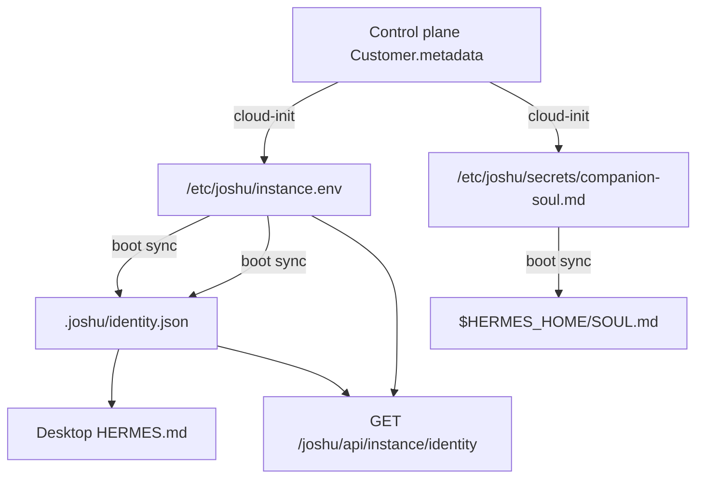

# Joshu identity

**Joshu** is the platform. Each deployed **instance** runs one named assistant (default **Patrick**) for one **owner** (default display name **Dan**). Voice, chat, and Hermes are parts of the same **brain** — not separate products delegating to each other.

## Terminology

| Term | Meaning |
|------|---------|
| **Joshu** | Platform (repo, sandbox stack, product name) |
| **Assistant** | Persona on an instance — `name`, `imageUrl` (portrait), `avatarUrl` (gravatar), `voiceId` |
| **Owner** | Human who owns the instance — `displayName` + login **email** |
| **Brain** | Hermes + gbrain + Hindsight (+ Realtime voice as I/O) |
| **Thinking** | Voice invokes the `think` tool → async Hermes work (same mind) |

## Storage

Identity on a box is **layered** — provision inputs, runtime files, and a merged API view:



### Canonical file (Joshu)

Per ArozOS user:

```text
${AROZ_DATA}/files/users/<JOSHU_AROZ_USER>/.joshu/identity.json
```

On VPS, `AROZ_DATA` is `/var/lib/arozos` (inside the `joshu-stack` container). Example for owner `db@project-aeon.com`:

```text
/var/lib/arozos/files/users/db@project-aeon.com/.joshu/identity.json
```

Example after control-plane provision (`source: control-plane`):

```json
{
  "schemaVersion": 1,
  "name": "Patrick",
  "imageUrl": "https://v3b.fal.media/files/b/…/portrait.jpg",
  "avatarUrl": "https://v3b.fal.media/files/b/…/avatar.jpg",
  "voiceId": "Callirrhoe",
  "owner": {
    "displayName": "Db",
    "email": "db@project-aeon.com"
  },
  "updatedAt": "2026-06-10T05:12:54.430Z",
  "source": "control-plane"
}
```

Before first sync, boxes bootstrap with `source: bootstrap` and factory defaults (`Patrick` / `Dan`, `imageUrl: null`).

| Field | Default | Notes |
|-------|---------|-------|
| `name` | `Patrick` | Assistant persona — not the platform name; shown in email signature |
| `imageUrl` | `null` | Full Ideogram portrait (`joshuImageUrl`); used in outbound email signature and public `/j/[slug]` |
| `avatarUrl` | `null` | Gravatar-style square headshot (`joshuAvatarUrl`); used in jChat, tray, and other in-app persona UI |
| `voiceId` | `null` | Gemini-TTS / Gemini Live voice name (e.g. `Callirrhoe`); falls back to `GEMINI_LIVE_VOICE` or `OPENAI_REALTIME_VOICE` |
| `owner.displayName` | `Dan` | Shown in prompts and UI; email signature role line is `{displayName}'s Joshu` |
| `owner.email` | *(env)* | From `JOSHU_OWNER_EMAIL` / `JOSHU_AROZ_USER` at read time |
| `source` | `bootstrap` | `control-plane` after companion sync |

**Bootstrap:** first `resolveJoshuIdentity()` writes the file if missing (`0o600` file, `0o700` dir).

### Hermes persona files

| Path | Role |
|------|------|
| `$HERMES_HOME/SOUL.md` | Companion personality from quiz `soul_md` (default `$HERMES_HOME=/root/.hermes`) |
| `<Desktop>/joshu's files/HERMES.md` | Box context — owner, assistant name, operating rules ([`hermesContextFile.ts`](../src/hermesContextFile.ts)) |

`SOUL.md` is written with marker `<!-- joshu-managed: companion-soul -->`. Hand-edited `SOUL.md` files **without** that marker are not overwritten.

### Provision inputs (host + container)

Written at cloud-init; readable on the VPS host and inside `joshu-stack`:

| Path | Contents |
|------|----------|
| `/etc/joshu/instance.env` | `JOSHU_NAME`, `JOSHU_OWNER_NAME`, `JOSHU_IMAGE_URL`, `JOSHU_AVATAR_URL`, `JOSHU_VOICE_ID`, `JOSHU_AROZ_USER`, `JOSHU_COMPANION_SOUL_FILE`, … |
| `/etc/joshu/secrets/companion-soul.md` | Full `companionSoulMd` from `Customer.metadata` (`0600`) |

ArozOS user data (`/var/lib/arozos`) lives in the **container** Docker volume `joshu_arozos`, not on a host path you can `cat` without `docker exec`.

### Viewing on a VPS (SSH)

All paths below run **on the box** after `ssh root@{slug}.box.joshu.me`.

```bash
CONTAINER=$(docker ps -qf name=joshu-stack | head -1)

# Merged identity (env overrides file) — easiest check
curl -s http://127.0.0.1:8788/joshu/api/instance/identity | jq .

# Provision env
docker exec "$CONTAINER" grep '^JOSHU_' /etc/joshu/instance.env

# Soul secret (control-plane input)
docker exec "$CONTAINER" cat /etc/joshu/secrets/companion-soul.md

# Canonical identity.json (resolve user from instance.env)
docker exec "$CONTAINER" bash -lc '
  source /etc/joshu/instance.env
  cat "/var/lib/arozos/files/users/${JOSHU_AROZ_USER}/.joshu/identity.json"
'

# Hermes SOUL
docker exec "$CONTAINER" cat /root/.hermes/SOUL.md
```

**Re-apply** after editing `instance.env` or `companion-soul.md` (localhost only):

```bash
curl -s -X POST http://127.0.0.1:8788/joshu/api/instance/sync-companion-identity \
  -H "Content-Type: application/json" \
  -d '{"forceSoul":true}' | jq .
```

Boot also syncs via [`companionIdentitySync.ts`](../src/companionIdentitySync.ts) in `server.ts` and [`deploy/scripts/vps-start.sh`](../deploy/scripts/vps-start.sh).

## Env overrides

Local dev and VPS `instance.env`:

| Variable | Maps to |
|----------|---------|
| `JOSHU_NAME` | `name` |
| `JOSHU_OWNER_NAME` | `owner.displayName` |
| `JOSHU_IMAGE_URL` | `imageUrl` (full portrait) |
| `JOSHU_AVATAR_URL` | `avatarUrl` (gravatar headshot) |
| `JOSHU_VOICE_ID` | `voiceId` |
| `JOSHU_COMPANION_SOUL_FILE` | Path to quiz `soul_md` secret (provision) → Hermes `SOUL.md` |
| `JOSHU_OWNER_EMAIL` / `JOSHU_AROZ_USER` | `owner.email` (not stored in file by default) |

Env wins over `identity.json`. On VPS, Joshu reads **`/etc/joshu/instance.env`** at resolve/sync time ([`provisionInstanceEnv.ts`](../src/provisionInstanceEnv.ts)) so `sync_companion_identity` works after instance-agent patches the file without a full stack restart.

**Soul vs secret:** provision writes quiz `soul_md` to `/etc/joshu/secrets/companion-soul.md`; Hermes loads **`$HERMES_HOME/SOUL.md`** (with `<!-- joshu-managed: companion-soul -->`). If `SOUL.md` still shows the default Hermes preamble, run localhost `POST …/sync-companion-identity` with `{"forceSoul":true}` and **restart the Hermes gateway** (or nudge `GET …/hermes-chat/status?after_mcp_boot=1`). Start a **new jChat session** after soul changes.

## API

| Method | Path | Purpose |
|--------|------|---------|
| `GET` | `/joshu/api/instance/identity` | Resolved persona for UIs and voice (file + env merge) |
| `POST` | `/joshu/api/instance/sync-companion-identity` | Re-write `identity.json` + `SOUL.md` from env/secret (**localhost only**); body `{"forceSoul":true}` overwrites non-managed `SOUL.md` |

Implementation: [`src/joshuIdentity.ts`](../src/joshuIdentity.ts), [`src/companionIdentitySync.ts`](../src/companionIdentitySync.ts), [`src/hermesSoulFile.ts`](../src/hermesSoulFile.ts), routes in [`src/instanceHealth.ts`](../src/instanceHealth.ts).

## EA / Nylas profile

EA-specific dials (`timezone`, `spendingThreshold`, …) stay in `.joshu/nylas/profile.json`. Name and owner sync both ways when profile is saved via [`src/nylas/profile.ts`](../src/nylas/profile.ts).

Executive-assistant templates still use `{{OWNER_NAME}}` / “Principal” as playbook vocabulary; bootstrap reads identity first.

## Control plane (hello.joshu)

Portal users **build their joshu at `/setup`** before entering a waitlist invite code:

1. Personality quiz (10 questions) → trait profile
2. Three LLM-generated companions (OpenRouter `deepseek/deepseek-v4-flash` via `DEFAULT_COMPANION_FORGE_MODEL`, `reasoning: none`) — bios stream to `/setup` as each finishes; fal portraits pipeline in the background with a per-slot loading timer
3. Pick a companion — name, portrait, `soul_md`, `visual_description` shown in portal
4. **Behind the scenes** (invisible to the user): LLM picks a **Gemini-TTS voice** from the companion + trait profile; **Nano Banana 2** generates a gravatar-style **avatar** from the Ideogram portrait
5. **`/joshu`** — edit joshu name (slug derived), review companion, personality plot + downloadable **identity card** (ISO ID-1 JPEG with portrait, owner, Epoch, contact, traits), referral program, enter waitlist code
6. Provision → `{slug}.box.joshu.me` and `{slug}@joshu.me`

**Identity card:** Owners download a branded wallet-style card from `/joshu` ([`JoshuIdentityCardShare.tsx`](../apps/control-plane/src/components/portal/JoshuIdentityCardShare.tsx)). **Epoch** is the Unix timestamp (`onboardingDraft.joshuCreatedAt`) from when they first picked their companion. Trait tags are the top-ranked **vibe** labels from quiz answers (not the seven numeric axes). See [control-plane-portal.md — `/joshu` owner page](vps-sandbox/control-plane-portal.md#joshu-owner-page).

**Persona refresh:** After provision, owners can retake the quiz at **`/setup?retake=1`** (or **Update companion** on `/dashboard`) to change companion portrait and persona on `Customer.metadata` and the public `/j/[slug]` page — slug, VPS, and Nylas mailbox are unchanged. Implementation: [`syncCustomerCompanion.ts`](../apps/control-plane/src/lib/syncCustomerCompanion.ts).

| When | Control plane | Box |
|------|---------------|-----|
| **Initial provision** | `metadata` → cloud-init `JOSHU_*` + `companion-soul.md` | Boot sync → `identity.json` + `SOUL.md` |
| **Persona refresh** | `Customer.metadata` + `/j/[slug]` update immediately | Instance agent `sync_companion_identity` → `identity.json` + `SOUL.md` (within one heartbeat) |
| **Existing accounts** | Silent backfill on sign-in / dashboard if `joshuVoiceId` or `joshuAvatarUrl` missing | Same `sync_companion_identity` queue when backfill completes |

### Companion voice + avatar (background enrichment)

When an owner **picks a companion** (or an **existing account** is missing voice/avatar), control plane runs enrichment **invisibly** — no UI loading state.

| Step | What | Implementation |
| --- | --- | --- |
| 1 | **Voice** | OpenRouter LLM picks one of 30 [Gemini-TTS voices](https://docs.cloud.google.com/text-to-speech/docs/gemini-tts) from companion persona + trait profile → `voice_id` / `joshuVoiceId` |
| 2 | **Avatar** | fal **Nano Banana 2 edit** (`fal-ai/nano-banana-2/edit`) takes Ideogram `portrait_image_url` → gravatar-style square headshot → `avatar_image_url` / `joshuAvatarUrl` |
| 3 | **Persist** | Draft candidate + `Customer.metadata` |
| 4 | **Box sync** | `sync_companion_identity` heartbeat → `JOSHU_IMAGE_URL`, `JOSHU_AVATAR_URL`, `JOSHU_VOICE_ID` → `identity.json` |

| Trigger | When enrichment runs |
| --- | --- |
| Companion selection | `after()` on `PUT /api/portal/onboarding/draft` — response returns immediately |
| Provision | `ensureSelectedCompanionEnriched()` blocks in `verify-invite` / `create-box` if background job not finished |
| Existing accounts | `scheduleExistingCustomerBackfill()` on sign-in (`POST /api/portal/sync-user`) and dashboard load |
| Persona refresh | Same as selection; metadata + box sync when enrichment completes |

Code: [`pickGeminiVoiceForCompanion.ts`](../apps/control-plane/src/lib/pickGeminiVoiceForCompanion.ts), [`geminiTtsVoices.ts`](../apps/control-plane/src/lib/geminiTtsVoices.ts), [`falAvatarClient.ts`](../apps/control-plane/src/lib/falAvatarClient.ts), [`companionAssetEnrichment.ts`](../apps/control-plane/src/lib/companionAssetEnrichment.ts).

**Image roles:**

| Asset | Metadata / draft | Box env | `identity.json` | Used for |
| --- | --- | --- | --- | --- |
| Portrait | `joshuImageUrl` / `portrait_image_url` | `JOSHU_IMAGE_URL` | `imageUrl` | Email signature, public `/j/[slug]`, identity card |
| Avatar | `joshuAvatarUrl` / `avatar_image_url` | `JOSHU_AVATAR_URL` | `avatarUrl` | jChat, ArozOS tray (`avatarUrl` preferred over `imageUrl`) |
| Voice | `joshuVoiceId` / `voice_id` | `JOSHU_VOICE_ID` | `voiceId` | Gemini Live (`GEMINI_LIVE_VOICE`) when `JOSHU_VOICE_PROVIDER=gemini_live` |

See [control-plane-portal.md — Persona refresh](vps-sandbox/control-plane-portal.md#persona-refresh-setupretake1).

Full flow, APIs, email signature, public page, persona refresh, and env: [vps-sandbox/control-plane-portal.md](vps-sandbox/control-plane-portal.md).

### Public profile (`/j/[slug]`)

Each reserved slug has a **public page** on hello.joshu at **`/j/{slug}`** — no auth required. Live when the slug is held in `JoshuSlugReservation` (companion picked) or provisioned on a non-terminated `Customer`.

| Shown | Notes |
| --- | --- |
| Portrait | Selected companion `portrait_image_url` |
| Name | User joshu display name (companion first name) |
| Owner | “This Joshu belongs to {ownerLabel}” — derived from email, not full address |
| Soul | Full `soul_md` when present |
| Email / homepage | `{slug}@joshu.me` and `{slug}.box.joshu.me` under portrait; box links only after provision |

Owners open **View public profile** from `/joshu` or `/dashboard`. Set `CONTROL_PLANE_URL` in production for correct OG metadata.

Implementation: [`publicJoshuIdentity.ts`](../apps/control-plane/src/lib/publicJoshuIdentity.ts), [`PublicJoshuIdentityView.tsx`](../apps/control-plane/src/components/portal/PublicJoshuIdentityView.tsx).

| On box | From slug |
| --- | --- |
| Subdomain | `{slug}.box.joshu.me` |
| Agent email | `{slug}@joshu.me` (Nylas) |
| Composio user id | `{slug}` |

Persona fields on `Customer.metadata`: `joshuName`, `joshuImageUrl` (portrait), `joshuAvatarUrl` (gravatar), `joshuVoiceId`, `companionSoulMd`, `companionVisualDescription`, `companionPortraitImagePrompt`, `companionGender`, `companionAge`, `companionArchetype`, `ownerDisplayName`. Written at initial provision and on **persona refresh** / **backfill**. Provision pushes `JOSHU_*` env vars and `companionSoulMd` → `/etc/joshu/secrets/companion-soul.md` via [`apps/control-plane/src/lib/sandboxEnv.ts`](../apps/control-plane/src/lib/sandboxEnv.ts); the box syncs into `identity.json` and Hermes `SOUL.md` on boot ([`companionIdentitySync.ts`](../src/companionIdentitySync.ts)).

On the VPS, runtime identity still lives in `.joshu/identity.json` (see above). Control plane `metadata.joshuName` is the user-chosen joshu display name from onboarding, not necessarily the companion persona name or the default “Patrick” bootstrap persona.

Portal and admin docs: [vps-sandbox/control-plane-portal.md](vps-sandbox/control-plane-portal.md).

## Voice

OpenAI Realtime uses the **`think`** tool (legacy aliases: `ask_joshu`, `delegate_to_joshu`) to reach the same brain as chat. Persona strings for the voice layer come from [`buildVoiceSystemPrompt()`](../packages/voice-realtime/src/joshuIdentity.ts) (`web` vs `phone`).

Both surfaces append **`Core Joshu context`** from [`templates/joshu-info/highlevel-info.md`](../templates/joshu-info/highlevel-info.md) when that file has content (compact, ≤2000 chars in the prompt).

| Surface | Prompt highlights |
| --- | --- |
| **Phone** | Call `think` immediately for files/desktop/memory — no spoken preamble; never claim you lack access; handler injects “One moment.” If `TWILIO_THINK_PASSWORD` is set, prompt asks the caller to **say** their passphrase (secret is **not** in the prompt); server enforces in `twilioRealtimeSession.ts`. |
| **Web** | Chat UI shows full brain output; at most one brief phrase when calling `think` |

| Env | Role |
| --- | --- |
| `TWILIO_PHONE_SYSTEM_PROMPT` / `JOSHU_WEB_VOICE_SYSTEM_PROMPT` | Replace built-in Realtime prompts entirely when set |
| `TWILIO_THINK_PASSWORD` | Phone-only: gate `think`/Hermes until caller speaks passphrase (fuzzy STT match) |
| `TWILIO_OWNER_CALLER` | Phone: owner vs non-owner greeting (non-owner hears 60s limit mention) |
| `OPENAI_REALTIME_VOICE` / `JOSHU_VOICE_ID` | OpenAI Realtime voice timbre when `JOSHU_VOICE_PROVIDER=openai` (default `alloy`) |
| `GEMINI_LIVE_VOICE` / `JOSHU_VOICE_ID` | Gemini Live voice when `JOSHU_VOICE_PROVIDER=gemini_live` (set from LLM voice pick, e.g. `Callirrhoe`) |

Phone call control lines (greeting, unlock, timeout) use `injectControlMessage()` — not the Hermes summary inject path.

Docs: [voice-think-speak.md](vps-sandbox/voice-think-speak.md) (when to think vs what to say, desktop access, duplicate acks, OpenAI dashboard), [web-voice.md](vps-sandbox/web-voice.md), [voice-realtime.md](vps-sandbox/voice-realtime.md) (PSTN security, timers, observability).
