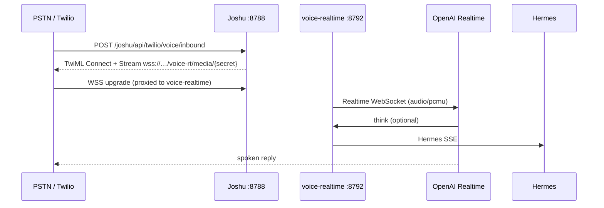
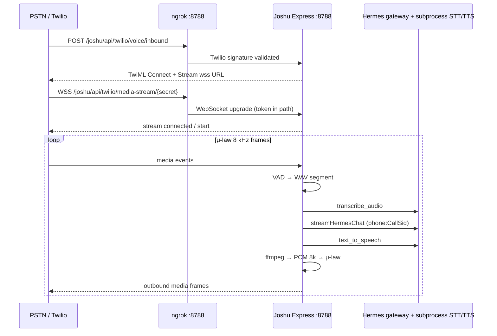

# Phone voice — local E2E (OpenAI Realtime S2S)

Validate PSTN → Joshu → `voice-realtime` → OpenAI Realtime before auto-provisioning numbers on DO.

**Validated locally (2026-05):** inbound webhook, Media Stream WSS, μ-law ↔ Realtime duplex, async Hermes `think`, ngrok → `8788`.

See [voice-realtime.md](voice-realtime.md) and [voice-think-speak.md](voice-think-speak.md).

## Architecture



## Legacy note

Joshu still contains [`twilioPhoneGateway.ts`](../../src/twilioPhoneGateway.ts) with an older subprocess STT/TTS loop at `/api/twilio/media-stream` for non-S2S setups. **Production and local dev should use `JOSHU_VOICE_MODE=realtime_s2s` and `/voice-rt/media` only.**

<details>
<summary>Archived: legacy subprocess architecture</summary>



</details>

| Port | Service | Twilio-relevant |
| --- | --- | --- |
| **8788** | Joshu Express (`npm run dev:arozos` starts this first) | **Use this for ngrok.** `/joshu/api/twilio/*` lives here. |
| **8787** | ArozOS public UI | Does **not** proxy `/joshu/api/*` — webhook health returns **404** if tunneled here. |

## Prerequisites

```bash
brew install ffmpeg portaudio
npm run hermes:update   # installs Hermes [voice] extras
```

## Secrets: what goes where

| Location | Variables | Notes |
| --- | --- | --- |
| **Repo root `.env`** | `TWILIO_*`, `PUBLIC_BASE_PATH`, `HERMES_BIN` | Local Joshu only; **not** copied to DO sandboxes. |
| **`~/.hermes/.env`** | `OPENAI_API_KEY`, `OPENROUTER_API_KEY`, … | STT/TTS/LLM for Hermes subprocess + gateway. |
| **`~/.hermes/config.yaml`** | `voice:`, `stt:`, `tts:` | VAD thresholds and provider choice. |
| **DO `/etc/joshu/instance.env`** | `DEFAULT_*` from control plane | Production; includes per-instance `TWILIO_MEDIA_STREAM_SECRET`. |

`TWILIO_MEDIA_STREAM_SECRET` is **generated by Joshu/control plane** (`openssl rand -hex 32`). It is **not** from the Twilio console.

`TWILIO_AUTH_TOKEN` must be the account **Primary Auth Token** (Console → Account → API keys & tokens) for the same subaccount that owns the phone number.

## Hermes cloud STT/TTS (`~/.hermes`)

Joshu phone uses Hermes `transcribe_audio` / `text_to_speech` via subprocess — configure **`~/.hermes/config.yaml`** and **`~/.hermes/.env`**, not Joshu `.env` (except Twilio).

**Legacy path** (Joshu `twilioPhoneGateway`, turn-based VAD):

```yaml
voice:
  silence_threshold: 200
  silence_duration: 2.5

stt:
  provider: openai

tts:
  provider: openai
```

`~/.hermes/.env`:

```dotenv
OPENAI_API_KEY=...
VOICE_TOOLS_OPENAI_KEY=...   # if your Hermes build uses this alias for STT/TTS
OPENROUTER_API_KEY=...        # Hermes gateway chat (LLM via OpenRouter)
```

**OpenAI Realtime S2S** (`JOSHU_VOICE_MODE=realtime_s2s`, `packages/voice-realtime`) — see [voice-realtime.md](voice-realtime.md) and [voice-think-speak.md](voice-think-speak.md). OpenAI Realtime duplex audio; personal/user work via async Hermes `think` (gbrain MCP, Hindsight, tools). Does **not** call Joshu `/api/brain/*`.

**Debugging a call:** `grep voice-realtime` in the `dev:arozos` terminal — look for `session ready` (greeting), `turn #N`, `auth`, `THINK START`, `ANTIPATTERN spoke-before-think`. Realtime usage usually appears under [Organization usage](https://platform.openai.com/settings/organization/usage) (`gpt-realtime-2`), not Chat Completions **Logs**. Phone security UX: [voice-realtime.md — Phone security and call UX](voice-realtime.md#phone-security-and-call-ux-pstn-only).

## Joshu `.env` (repo root)

```dotenv
PUBLIC_BASE_PATH=/joshu

# Primary Auth Token for signature validation on POST /voice/inbound
TWILIO_AUTH_TOKEN=...

# URL-safe hex only — NOT openssl rand -base64 32 (+ / = break URLs)
TWILIO_MEDIA_STREAM_SECRET=<openssl rand -hex 32>

# Must match Twilio Console → number → Voice webhook exactly (POST)
TWILIO_VOICE_WEBHOOK_URL=https://<tunnel-host>/joshu/api/twilio/voice/inbound

HERMES_BIN=/path/to/hermes-agent/venv/bin/hermes
```

Optional:

```dotenv
JOSHU_VOICE_MODE=realtime_s2s
OPENAI_API_KEY=...
HERMES_API_KEY=...               # same as gateway API_SERVER_KEY
# Override auto-derived wss URL (path token required for ngrok — see below)
# TWILIO_MEDIA_STREAM_WSS_URL=wss://<tunnel-host>/voice-rt/media/<secret>
# TWILIO_PHONE_SYSTEM_PROMPT=...   # replaces built-in phone prompt — include think/desktop rules if set
# TWILIO_THINK_PASSWORD=your-passphrase   # gates think/Hermes on phone; STT-tolerant fuzzy match
# TWILIO_OWNER_CALLER=+15551234567        # optional owner caller id (greeting + 60s mention for others)
# TWILIO_PHONE_SESSION_WARN_MS=60000
# TWILIO_PHONE_SESSION_HANGUP_MS=90000    # disabled after passphrase unlock
# OPENAI_REALTIME_VOICE=alloy
```

### Media Stream URL shape (important)

With `JOSHU_VOICE_MODE=realtime_s2s`, Joshu proxies Twilio to **voice-realtime** (`/voice-rt/media/…`). Typical local URL (one ngrok on Joshu `:8788`):

```text
wss://<host>/voice-rt/media/<TWILIO_MEDIA_STREAM_SECRET>
```

Legacy subprocess path (do not use for S2S):

```text
wss://<host>/joshu/api/twilio/media-stream/<TWILIO_MEDIA_STREAM_SECRET>
```

The secret is in the **path**, not `?token=`.

**Why:** ngrok (and some reverse proxies) forward HTTP webhooks fine but **strip query strings on WebSocket upgrades**. Symptom: `POST …/voice/inbound 200` then immediate hangup, or log line `media stream rejected (bad token)` with `tokenLen=0`.

Implementation: [`mediaStreamPathWithToken`](../../src/twilioPhoneGateway.ts), [`audioMulawCodec.ts`](../../src/audioMulawCodec.ts).

## Run stack + tunnel

### Recommended: one ngrok (`scripts/twilio-local-dev.sh`)

Proxy on **8790** forwards `/joshu`, `/voice-rt`, and `/voice` so you only run **one** ngrok tunnel.

| Terminal | Command |
| --- | --- |
| 1 | `npm run dev:arozos` |
| 2 | `npm run voice-realtime:dev` (if not autostarted by dev:arozos) |
| 3 | `npm run twilio-local:proxy` |
| 4 | `npm run twilio-local:ngrok` |
| 5 | `npm run twilio-local:urls` then `npm run twilio-local:env` — merge `.env.twilio.local` into `.env`, **restart Joshu** |

```bash
npm run twilio-local:check
```

### Manual: ngrok on Joshu only (legacy)

Terminal 1:

```bash
npm run dev:arozos
```

Terminal 2:

```bash
# Tunnel Joshu directly (8788), NOT ArozOS (8787)
ngrok http 8788
```

Copy the **https** forwarding URL into `TWILIO_VOICE_WEBHOOK_URL` and restart Joshu if the ngrok host changed.

Twilio Console → your number → **Voice webhook** = exact `TWILIO_VOICE_WEBHOOK_URL` (HTTP **POST**).

## Preflight

```bash
npm run phone-voice:check
# Or with explicit tunnel origin:
PHONE_VOICE_PUBLIC_HOST=https://abc.ngrok-free.app npm run phone-voice:check
```

## Verify (happy path)

1. `GET https://<tunnel>/joshu/api/twilio/health` → `{ "ok": true, "hermesReady": true }`
2. Call the Twilio number.
3. Joshu logs (in order):

```text
[twilio-phone] inbound voice callSid=CA… from=+1…
POST /joshu/api/twilio/voice/inbound 200 … - 228
[twilio-phone] media stream websocket upgrade ok path=/joshu/api/twilio/media-stream
[twilio-phone] stream websocket open
[twilio-phone] stream protocol connected
[twilio-phone] stream start callSid=CA… streamSid=MZ…
```

4. Speak; pause ~2.5s (VAD). Then:

```text
[twilio-phone] transcript (CA…): …
```

5. Hermes session key: `phone:<CallSid>`.

TwiML body length ~**228 bytes** with a 64-char hex secret (path URL). Older `?token=` TwiML was ~234 bytes.

## Troubleshooting

| Symptom | Likely cause | Fix |
| --- | --- | --- |
| `403 bad signature` | Auth token or webhook URL mismatch | Use **Primary Auth Token**; `TWILIO_VOICE_WEBHOOK_URL` must match Twilio console **character-for-character** (including `/joshu`, no stray trailing slash unless console has one). Joshu tries env URL + `x-forwarded-host` variants. |
| `GET …/twilio/health` **404** via tunnel | ngrok points at **8787** | `ngrok http 8788` |
| `POST …/inbound 200` then **immediate hangup** | WSS never authenticated | See Media Stream URL shape above; restart after changing secret; watch for `bad token` / `tokenLen=0` |
| `media stream rejected (bad token)` + `tokenLen=0` | Query token stripped by ngrok | Path token (current default); hex secret |
| `media stream rejected (bad token)` + non-zero `tokenLen` | Secret mismatch | Restart Joshu after `.env` change; one secret in TwiML and upgrade handler |
| Spam `Cannot read properties of undefined (reading 'decode')` | `alawmulaw` CJS import | Fixed in `src/audioMulawCodec.ts` — use default import, not `import * as` |
| No transcript after speaking | VAD too aggressive or short utterance | Lower `voice.silence_duration` in `~/.hermes/config.yaml`; speak ≥ ~0.35s |
| `transcribe:` / `TTS:` warnings | Hermes provider keys | Check `~/.hermes/.env` and `stt`/`tts` providers in `config.yaml` |
| No audio reply | Missing ffmpeg or TTS failure | `brew install ffmpeg`; check Hermes TTS logs |
| Long silence before reply | voice-realtime not running | `npm run voice-realtime:dev` or restart `dev:arozos` |

### Debug checklist (ordered)

1. Health: `curl -H 'ngrok-skip-browser-warning: 1' https://<tunnel>/joshu/api/twilio/health`
2. Inbound: Twilio debugger shows `200` on voice URL
3. WSS: log line `media stream websocket upgrade ok` (not `bad token`)
4. Stream: log line `stream start`
5. Audio codec: no `decode` errors on `media` events
6. STT: log line `transcript`
7. LLM/TTS: Hermes gateway + ffmpeg on host

## Production (DO sandbox)

- Control plane injects `TWILIO_MEDIA_STREAM_SECRET`, `TWILIO_VOICE_WEBHOOK_URL`, `TWILIO_AUTH_TOKEN` into `/etc/joshu/instance.env` at provision.
- Auto-buy flow: [`twilioProvisioner.ts`](../../apps/control-plane/src/lib/twilioProvisioner.ts) sets voice webhook + path-style WSS URL after public health.
- Smoke test: [`scripts/do-phone-voice-smoke.md`](../../scripts/do-phone-voice-smoke.md).
See [voice-realtime.md](voice-realtime.md) + `JOSHU_VOICE_MODE=realtime_s2s` (Caddy proxies `/voice-rt/*` → voice-realtime).

## Related code

| File | Role |
| --- | --- |
| [`src/twilioPhoneGateway.ts`](../../src/twilioPhoneGateway.ts) | Inbound TwiML, WSS upgrade, VAD, Hermes STT/chat/TTS loop |
| [`src/audioMulawCodec.ts`](../../src/audioMulawCodec.ts) | μ-law ↔ PCM16 (CJS-safe `alawmulaw` import) |
| [`scripts/phone-voice-local-check.mjs`](../../scripts/phone-voice-local-check.mjs) | Preflight script |
| [`packages/voice-realtime/`](../../packages/voice-realtime/) | OpenAI Realtime S2S (`JOSHU_VOICE_MODE=realtime_s2s`) |
| [`packages/voice-realtime/`](../../packages/voice-realtime/) | OpenAI speech-to-speech (`JOSHU_VOICE_MODE=realtime_s2s`) |
