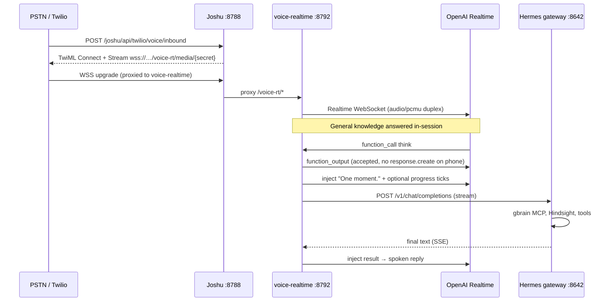

# Speech-to-Speech Voice (OpenAI Realtime)

Low-latency **speech-to-speech** voice using OpenAI Realtime (`gpt-realtime-2`):

- **PSTN** — Twilio Media Streams (`audio/pcmu`)
- **Browser** — jChat / jMail WebSocket (`audio/pcm`, 24 kHz) — see [web-voice.md](web-voice.md)

**Core model:** [voice-think-speak.md](voice-think-speak.md) — when to **think** (Hermes) vs what to **say** (Realtime speech).

Implementation: [`packages/voice-realtime/`](../../packages/voice-realtime/).

## Architecture



| Layer | Path | Role |
| --- | --- | --- |
| **Inbound TwiML** | Joshu [`twilioPhoneGateway.ts`](../../src/twilioPhoneGateway.ts) | Signature check, `<Connect><Stream>` URL |
| **Voice UX** | `packages/voice-realtime` (`:8792`) | OpenAI Realtime session, Twilio μ-law or browser PCM24k, barge-in, tool dispatch |
| **Browser apps** | Same service, `BrowserRealtimeSession` | WSS `browser_start` / `browser_audio` — [web-voice.md](web-voice.md) |
| **Personal / user work** | Hermes `POST :8642/v1/chat/completions` | Files (gbrain MCP), Hindsight, writes, browser, shell |

Joshu proxies `/voice-rt/*` → `127.0.0.1:8792` ([`src/server.ts`](../../src/server.ts)).

Phone vs browser share `OpenAiRealtimeClient` but use separate session classes — see [voice-think-speak.md](voice-think-speak.md).

### Audio path

Follows [Twilio's OpenAI Realtime sample](https://github.com/twilio-samples/speech-assistant-openai-realtime-api-python):

- **Native `audio/pcmu`** end-to-end for PSTN (no ffmpeg resampling in the hot path)
- **PCM24k** for browser
- Direct delta forwarding ↔ OpenAI
- Mark queue + `conversation.item.truncate` on barge-in (phone)

Key files: `twilioRealtimeSession.ts`, `browserRealtimeSession.ts`, `openaiRealtimeClient.ts`.

### OpenAI stack (no separate TTS)

Joshu does **not** call `POST /v1/audio/speech` for phone or browser voice. All audible output is **OpenAI Realtime** over a WebSocket ([`openaiRealtimeClient.ts`](../../packages/voice-realtime/src/openaiRealtimeClient.ts)):

| Setting | Default | Role |
| --- | --- | --- |
| `OPENAI_REALTIME_MODEL` | `gpt-realtime-2` | S2S model |
| `OPENAI_REALTIME_VOICE` | `alloy` (or `JOSHU_VOICE_ID` from identity) | Spoken voice timbre |
| Input transcription (fixed in code) | `gpt-4o-mini-transcribe` | User speech → text on phone/browser |

Hermes (`think`) is a **separate** Chat Completions stream — it may appear in Langfuse; Realtime audio usually does not appear in [API Logs](https://platform.openai.com/logs). See [OpenAI Platform observability](voice-think-speak.md#openai-platform-observability).

### Why voice does not call `/api/brain/*`

Joshu exposes read-only brain HTTP routes for other fast clients ([`file-brain.md`](../file-brain.md)). **Voice does not use them.** Hermes already holds the PGLite lock via `gbrain serve`; a parallel `gbrain search` CLI from the brain API causes lock timeouts (502 / 15s+ hangs). All personal reads go through Hermes → gbrain MCP in one lane.

## Enable on VPS

```bash
JOSHU_VOICE_MODE=realtime_s2s
OPENAI_API_KEY=...
HERMES_API_KEY=...              # same as API_SERVER_KEY from provision
HERMES_API_BASE_URL=http://127.0.0.1:8642
TWILIO_MEDIA_STREAM_WSS_URL=wss://<customer>/voice-rt/media/<secret>
# Optional:
# OPENAI_REALTIME_MODEL=gpt-realtime-2
# OPENAI_REALTIME_REASONING_EFFORT=low
# VOICE_PHONE_VAD_MODE=server_vad
# VOICE_PHONE_VAD_SILENCE_MS=500
# VOICE_PHONE_VAD_MODE=semantic_vad
# VOICE_PHONE_VAD_EAGERNESS=high
# VOICE_PHONE_VAD_THRESHOLD=0.62
# OPENAI_REALTIME_VOICE=alloy
# TWILIO_THINK_PASSWORD=your-passphrase
# TWILIO_OWNER_CALLER=+15551234567
# TWILIO_PHONE_SESSION_WARN_MS=60000
# TWILIO_PHONE_SESSION_HANGUP_MS=90000
# JOSHU_HERMES_MODEL=~anthropic/claude-sonnet-latest
# TWILIO_PHONE_SYSTEM_PROMPT=...
```

Control plane can set `TWILIO_THINK_PASSWORD` from `DEFAULT_TWILIO_THINK_PASSWORD` ([`sandboxEnv.ts`](../../apps/control-plane/src/lib/sandboxEnv.ts)).

Compose profile **`voice-rt`** starts the service on port **8792**. Caddy proxies `/voice-rt/*` → `127.0.0.1:8792`.

The `voice-realtime` image is published to GHCR alongside `joshu-sandbox` (**`ghcr.io/<org>/joshu-voice-realtime:<version>`**). `npm run vps:build-image` builds and pushes both when `JOSHU_IMAGE_PUSH=1`.

Compose uses **`JOSHU_VOICE_IMAGE_REF`** from `/etc/joshu/instance.env` (set at provision and on every release update). Local fallback: `docker compose build voice-realtime` when no GHCR ref is set.

**Release updates:** When `JOSHU_VOICE_MODE=realtime_s2s`, the instance agent `pull`s the voice image (same tag as sandbox), recreates `joshu-stack`, waits for health, then `force-recreate voice-realtime` (profile `voice-rt`). No host `npm install` build on production boxes.

After changing `packages/voice-realtime/` locally, rebuild the voice image (`npm run vps:build-image` or `docker compose build voice-realtime`) before recreate.

**Provider:** `JOSHU_VOICE_PROVIDER=gemini_live` + `GEMINI_API_KEY` selects Gemini Live for browser and PSTN; default `openai` uses OpenAI Realtime. OpenAI phone uses manual turns (`create_response=false`); Gemini phone auto-responds like browser (see [Gemini PSTN](#gemini-pstn-twilio)).

```bash
# Production (GHCR)
docker compose -f deploy/docker-compose.yml --env-file /etc/joshu/instance.env --profile voice-rt \
  pull voice-realtime
docker compose -f deploy/docker-compose.yml --env-file /etc/joshu/instance.env --profile voice-rt \
  up -d --force-recreate voice-realtime

# Local dev (no GHCR ref)
docker compose -f deploy/docker-compose.yml --env-file /etc/joshu/instance.env build voice-realtime
docker compose -f deploy/docker-compose.yml --env-file /etc/joshu/instance.env --profile voice-rt up -d voice-realtime
```

Control plane sets `TWILIO_MEDIA_STREAM_WSS_URL` automatically when `JOSHU_VOICE_MODE=realtime_s2s` ([`sandboxEnv.ts`](../../apps/control-plane/src/lib/sandboxEnv.ts)).

## Gemini PSTN (Twilio)

When `JOSHU_VOICE_PROVIDER=gemini_live`, phone and browser share the same Gemini Live upstream. PSTN differs from OpenAI phone:

| OpenAI PSTN | Gemini PSTN |
| --- | --- |
| `create_response=false` — Joshu calls `requestOrganicResponse()` after transcript | Gemini auto-responds on end-of-speech (like jChat) |
| Cancels unexpected organic via `response.cancel` | **Mutes** pre-user echo/noise (no `clientContent` interrupt — that garbled turn 2+) |
| Manual turn gate via `joshuInitiatedResponse` | Personal work still via `think` tool + Hermes inject |

Implementation: [`twilioRealtimeSession.ts`](../../packages/voice-realtime/src/twilioRealtimeSession.ts), [`geminiLiveClient.ts`](../../packages/voice-realtime/src/geminiLiveClient.ts) (`onInterrupted` vs user barge-in).

## Phone security and call UX (PSTN only)

Browser voice is **not** passphrase-gated. Phone-only behavior lives in [`twilioRealtimeSession.ts`](../../packages/voice-realtime/src/twilioRealtimeSession.ts) and [`phonePassphrase.ts`](../../packages/voice-realtime/src/phonePassphrase.ts).

### Think passphrase (`TWILIO_THINK_PASSWORD`)

When set, Hermes (`think`) is **blocked server-side** until the caller unlocks the call. General world-knowledge answers still work without the passphrase.

| Stage | Behavior |
| --- | --- |
| Call start | `thinkAuthorized = false` (unless env unset) |
| User says passphrase | Fuzzy match on transcript ([`matchesThinkPassphrase`](../../packages/voice-realtime/src/phonePassphrase.ts)) — handles STT drift (e.g. env `Falken's Maze` vs heard `Falcon's Maze`) |
| Realtime calls `think` early | Server also checks `user_quote`, `summary`, and call transcript; may unlock from `think_tool` source |
| After unlock | Session time limit **disabled**; passphrase **redacted** from Hermes `summary` / `user_quote` / transcript context |
| Passphrase-only turn | Speaks *"Unlocked. Please repeat your request."* — does **not** forward the passphrase as a Hermes command |
| Restate intent | If unlock utterance was **only** the passphrase, `think` stays blocked until the user states a task (or a prior task-like utterance is still in the call transcript) |

The Realtime system prompt ([`buildVoiceSystemPrompt(..., "phone")`](../../packages/voice-realtime/src/joshuIdentity.ts)) tells the model to **ask for** the passphrase but **does not include the secret** — matching and enforcement are server-side only (`blocked think call before passphrase` in logs).

Env value: wrapping quotes are stripped (`"Falken's Maze"` → `Falken's Maze`).

### Session time limits

Defaults: **60s** spoken warning, **90s** goodbye + WebSocket close (hang up ~2.5s later). Tunable via `TWILIO_PHONE_SESSION_WARN_MS` / `TWILIO_PHONE_SESSION_HANGUP_MS` (legacy alias `TWILIO_PHONE_SESSION_MAX_MS` for warn).

Timers run for every call until **passphrase unlock** (`disableSessionTimeLimit("passphrase")`). They are independent of owner vs non-owner.

### Greeting and owner caller

On OpenAI `session.ready`, Joshu injects a **greeting** via `injectControlMessage()` (not `injectAssistantMessage()` — the latter wraps Hermes-style instructions and caused wrong lines like “I need the topic…”).

| `TWILIO_OWNER_CALLER` | Greeting |
| --- | --- |
| Unset | *"Hi. Great to hear from you."* |
| Set, caller matches | Same as owner |
| Set, caller differs | *"Hello. Friendly heads up: this phone session is limited to sixty seconds."* |

Joshu TwiML forwards `caller` and `ownerCaller` on the Media Stream ([`twilioPhoneGateway.ts`](../../src/twilioPhoneGateway.ts) → `stream.parameter`).

### Control vs Hermes speech injects

| API | Use on phone |
| --- | --- |
| `injectControlMessage()` | Greeting, unlock prompts, session timeout lines |
| `injectProgressMessage()` | *"One moment."* and long-job ticks |
| `injectAssistantMessage()` | Hermes result summary after `think` completes |

All three end in `response.create`, but control/progress use short, explicit instruct text; Hermes inject uses [`speechPresentation.ts`](../../packages/voice-realtime/src/speechPresentation.ts) (`voice_only`).

### Core Joshu context in prompts

[`templates/joshu-info/highlevel-info.md`](../../templates/joshu-info/highlevel-info.md) is loaded at startup (whitespace collapsed, max ~2000 chars) and appended to phone/web Realtime prompts as `Core Joshu context: …`. Edit that file to change baseline product knowledge without redeploying prompt strings in code.

## Local dev

### Prerequisites

Same Twilio wiring as [phone-voice-local-test.md](phone-voice-local-test.md) (`TWILIO_AUTH_TOKEN`, hex `TWILIO_MEDIA_STREAM_SECRET`, path-style WSS URL).

Repo root `.env`:

```dotenv
JOSHU_VOICE_MODE=realtime_s2s
OPENAI_API_KEY=...
HERMES_API_KEY=...              # must match Joshu/Hermes gateway
HERMES_API_BASE_URL=http://127.0.0.1:8642
```

Hermes gateway must be running (`npm run dev:arozos` starts the stack). gbrain should be up for file/journal queries ([`file-brain.md`](../file-brain.md)).

### Option A — simple (one ngrok on Joshu)

| Terminal | Command |
| --- | --- |
| 1 | `npm run dev:arozos` |
| 2 | `npm run voice-realtime:dev` (if not autostarted) |
| 3 | `ngrok http 8788` |

Then update Twilio Console → number → **Voice webhook** (not Messaging) if the ngrok host changed:

```bash
npm run twilio-local:urls
npm run twilio-local:env    # merge .env.twilio.local, restart Joshu
npm run twilio-local:check
```

Media stream URL (path token, ngrok-safe):

```text
wss://<tunnel>/voice-rt/media/<TWILIO_MEDIA_STREAM_SECRET>
```

### Option B — twilio-local helper (proxy + ngrok)

See [phone-voice-local-test.md](phone-voice-local-test.md#recommended-one-ngrok-scriptstwilio-local-devsh). Proxy on `:8790` forwards `/joshu` and `/voice-rt`.

## Realtime tool: `think`

Single tool registered with OpenAI Realtime ([`realtimeTools.ts`](../../packages/voice-realtime/src/realtimeTools.ts)):

| User intent | Handler |
| --- | --- |
| General world knowledge | Realtime answers directly (no tool) |
| User files, journals, notes, desktop, memory | `think` → Hermes |
| Writes, browser, multi-step tasks | `think` → Hermes |

Legacy tool names `ask_joshu` and `delegate_to_joshu` are still accepted as aliases.

Full phone vs browser behavior: [voice-think-speak.md](voice-think-speak.md).

### Async UX (while Hermes works)

**Phone (Twilio)** — [`twilioRealtimeSession.ts`](../../packages/voice-realtime/src/twilioRealtimeSession.ts):

1. Realtime calls `think` → `function_output` with **`triggerResponse: false`** (model must not speak from tool JSON)
2. Joshu injects **"One moment."** via `injectProgressMessage` (single wait line)
3. **Progress lines** (optional, for long jobs) — response-aware scheduling after that line finishes
4. When Hermes SSE completes → result injected → Realtime speaks the full phone summary

PSTN also uses **`create_response: false`** on server VAD plus [`userInputGate`](../../packages/voice-realtime/src/userInputGate.ts) so only **clear** transcripts trigger `requestOrganicResponse()`. See [voice-think-speak.md — Phone turn control](voice-think-speak.md#phone--who-triggers-the-next-realtime-response).

**Browser** — [`browserRealtimeSession.ts`](../../packages/voice-realtime/src/browserRealtimeSession.ts):

1. Chat UI always gets Hermes (one job per turn — see [web-voice.md](web-voice.md))
2. `think` records function output **without** `response.create` (avoids ack + inject double speech)
3. When Hermes completes and `voiceInject=true` → single co-present summary for audio

Desktop/file questions on phone: Realtime cannot see the desktop; **`think` is the access path**. If the user hears “I don’t have access” then a lookup, grep **`ANTIPATTERN spoke-before-think`** — [voice-think-speak.md — Realtime vs brain](voice-think-speak.md#realtime-vs-brain-desktop--files).

Progress tuning (phone + browser long jobs):

```bash
VOICE_HERMES_PROGRESS_FIRST_DELAY_MS=10000
VOICE_HERMES_PROGRESS_INTERVAL_MS=10000
VOICE_HERMES_PROGRESS_POST_SPEECH_MS=2000
VOICE_HERMES_PROGRESS_MAX_TICKS=12
```

## Logging

Structured logs use the prefix `[voice-realtime]` (grep-friendly):

```bash
grep voice-realtime
```

Happy-path sequence (phone):

```text
[voice-realtime] ws upgrade ok path=/voice-rt/media/…
[voice-realtime] callSid=CA… twilio stream start
[voice-realtime] callSid=CA… openai session ready ms=…
[voice-realtime] callSid=CA… turn #1 USER → "What files are on my desktop?"
[voice-realtime] callSid=CA… turn #1 resp #1 SPEECH START source=organic …
[voice-realtime] callSid=CA… tool invoke think { intent: 'browse_desktop', … }
[voice-realtime] callSid=CA… turn #1 THINK START job=… intent="browse_desktop"
[voice-realtime] callSid=CA… speech-instruct … reason=progress ("One moment.")
[voice-realtime] callSid=CA… think done job=… ms=… { preview: '…' }
[voice-realtime] callSid=CA… speech-instruct … reason=hermes_inject
```

Enable verbose OpenAI event logging: `VOICE_REALTIME_DEBUG=true`.

Useful log lines:

| Tag / message | Meaning |
| --- | --- |
| `turn #N USER →` | Validated PSTN transcript; organic response requested |
| `turn #N THINK START` | Hermes job accepted for this call |
| `SPEECH OUT source=organic\|progress\|hermes_inject\|…` | What Realtime actually said (transcript) |
| `speech-instruct response.create` | Joshu asked Realtime to speak (inject / progress / reprompt) |
| `ANTIPATTERN spoke-before-think` | Model spoke (often a denial) in the **same** response as `think` |
| `auth think password accepted` | Passphrase matched (source `transcript` or `think_tool`) |
| `auth blocked think call before passphrase` | Server denied `think`; Realtime may need another unlock attempt |
| `auth blocked think until caller restates intent` | Unlocked but passphrase-only; waiting for task restatement |
| `auth session time limit disabled (passphrase)` | 60s/90s timers cleared after unlock |
| `UNEXPECTED organic response — cancelling` | OpenAI only: VAD noise while `create_response=false` | On Gemini PSTN, should not appear — if paired with `clientContent interrupt`, rebuild voice-realtime |
| Garbled PSTN audio turn 2+ (Gemini) | OpenAI manual-turn gate + Gemini auto-VAD + interrupt loop | Image with Gemini PSTN fix; grep should show `gemini pre-user organic (muting` not repeated `UNEXPECTED organic` |
| `skip duplicate brain` (browser) | Same utterance; see [web-voice.md](web-voice.md) |

Cancelled `response.done` lines often have **no** `SPEECH OUT` — audio the user heard may still have started; use `VOICE_REALTIME_DEBUG` for raw OpenAI events.

## OpenAI Platform dashboard

Realtime WebSocket traffic **does not** usually appear in [API Logs](https://platform.openai.com/logs) the way Chat Completions do. Confirm billing and volume on [Organization usage](https://platform.openai.com/settings/organization/usage): **All projects**, correct date (UTC), model **`gpt-realtime-2`** (or your `OPENAI_REALTIME_MODEL`).

Hermes **`think`** jobs may show in **Langfuse**; that is separate from Realtime audio. For voice debugging, prefer **`[voice-realtime]`** logs above.

**Which API key bills the call?** [`packages/voice-realtime/src/config.ts`](../../packages/voice-realtime/src/config.ts): `OPENAI_API_KEY` → `VOICE_TOOLS_OPENAI_KEY` → `HINDSIGHT_API_LLM_API_KEY`. Loaded from repo `.env`, then `.env.twilio.local`, then `~/.hermes/.env` ([`loadEnv.ts`](../../packages/voice-realtime/src/loadEnv.ts)) — **last file wins**. Match that key to the org/project in the dashboard.

Full write-up: [voice-think-speak.md — OpenAI Platform observability](voice-think-speak.md#openai-platform-observability).

## Troubleshooting

| Symptom | Cause | Fix |
| --- | --- | --- |
| Two “checking / thinking” lines on `think` | Duplicate ack paths or spoke-before-think | [voice-think-speak.md — Avoiding duplicate acknowledgments](voice-think-speak.md#avoiding-duplicate-spoken-acknowledgments); grep `ANTIPATTERN` |
| “I don’t have access to your desktop” then it looks up anyway | Realtime spoke in same turn as `think` | [Realtime vs brain](voice-think-speak.md#realtime-vs-brain-desktop--files); tighten or remove custom `TWILIO_PHONE_SYSTEM_PROMPT` |
| First desktop question ignored; works on repeat | `think` not called on first turn | Grep `tool invoke think` vs `THINK START`; barge-in / cancelled responses |
| No Realtime usage in OpenAI Logs | Logs are Chat/Responses-oriented | Use Usage dashboard + local `[voice-realtime]` logs; [observability](voice-think-speak.md#openai-platform-observability) |
| Usage in dashboard but wrong org | Key from `~/.hermes/.env` or Hindsight fallback | Align `OPENAI_API_KEY` with the org you monitor |
| Two Langfuse Hermes traces per voice turn (browser) | Duplicate brain trigger | Grep `skip duplicate brain`; see [web-voice.md](web-voice.md) |
| Two spoken summaries after one Hermes answer (browser) | Duplicate `response.create` | Browser uses `function_output only`; grep `speech-instruct` |
| Random barge-in (browser) | Echo into server VAD | See [web-voice.md — Barge-in](web-voice.md#barge-in-browser) |
| Instant hangup after inbound 200 | Wrong ngrok URL or WSS token | `npm run twilio-local:urls`; secret in **path** not `?token=` |
| `ws rejected bad token` | Secret mismatch | Hex secret; path-style URL |
| Choppy PSTN audio | Wrong codec | Should be native `audio/pcmu` |
| Empty journal / file results | Missing embeddings | [`file-brain.md`](../file-brain.md) |
| `HERMES_API_KEY missing` at startup | Env not loaded | Set in repo `.env` |
| voice-realtime not running (browser) | Service down | `npm run voice-realtime:dev` or restart `dev:arozos` |
| No greeting until user speaks | Greeting before Realtime ready | Fixed: greeting on `onReady`; grep `session ready` then `speech-instruct` |
| Weird greeting / “need the topic” | `injectAssistantMessage` for greeting | Use `injectControlMessage` for call control lines |
| Passphrase never unlocks | Exact string match only / env quotes | Fuzzy match in `phonePassphrase.ts`; strip quotes in config |
| Passphrase sent to Hermes as a task | Unlock forwarded as command | Redact + auth-only unlock path; grep `sanitizeTextForThinkContext` |
| `restate_after_unlock` loop | Flag not cleared | First clear post-unlock utterance clears; prior task in transcript can skip restate |
| Call hangs up at ~90s | Session timer | Say passphrase to disable timers, or raise `TWILIO_PHONE_SESSION_HANGUP_MS` |

## Source layout

| File | Role |
| --- | --- |
| [`index.ts`](../../packages/voice-realtime/src/index.ts) | HTTP health, WSS upgrade, Twilio + browser protocol |
| [`twilioRealtimeSession.ts`](../../packages/voice-realtime/src/twilioRealtimeSession.ts) | Phone ↔ OpenAI bridge, `think` dispatch, progress |
| [`browserRealtimeSession.ts`](../../packages/voice-realtime/src/browserRealtimeSession.ts) | Browser ↔ OpenAI PCM24k, chat sync, turn dedupe |
| [`openaiRealtimeClient.ts`](../../packages/voice-realtime/src/openaiRealtimeClient.ts) | Realtime WS client, tool output, inject/progress speech |
| [`brainThink.ts`](../../packages/voice-realtime/src/brainThink.ts) | Hermes SSE delegate |
| [`speechPresentation.ts`](../../packages/voice-realtime/src/speechPresentation.ts) | Inject wording (screen vs voice_only) |
| [`realtimeTools.ts`](../../packages/voice-realtime/src/realtimeTools.ts) | `think` tool definition |
| [`joshuIdentity.ts`](../../packages/voice-realtime/src/joshuIdentity.ts) | Realtime + think system prompts |
| [`userInputGate.ts`](../../packages/voice-realtime/src/userInputGate.ts) | PSTN transcript gate (clear / unclear / empty) |
| [`phonePassphrase.ts`](../../packages/voice-realtime/src/phonePassphrase.ts) | STT-tolerant think passphrase matching |
| [`loadEnv.ts`](../../packages/voice-realtime/src/loadEnv.ts) | `.env` load order for voice-realtime |
| [`templates/joshu-info/highlevel-info.md`](../../templates/joshu-info/highlevel-info.md) | Baseline Joshu context for Realtime prompts |
| [`packages/voice-client/`](../../packages/voice-client/) | Shared browser WebSocket client |
| [`src/server.ts`](../../src/server.ts) | Joshu proxy `/voice-rt` → `:8792` |
| [`src/twilioPhoneGateway.ts`](../../src/twilioPhoneGateway.ts) | Inbound TwiML + WSS URL |

See also [voice-think-speak.md](voice-think-speak.md), [web-voice.md](web-voice.md), and [phone-voice-local-test.md](phone-voice-local-test.md).
