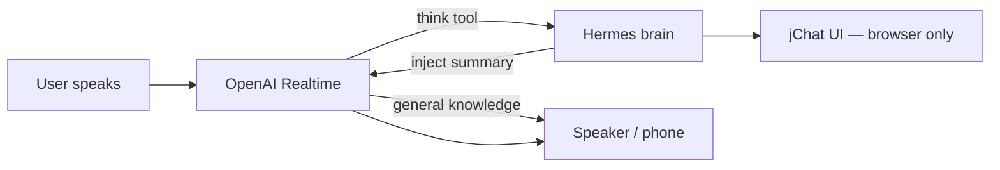
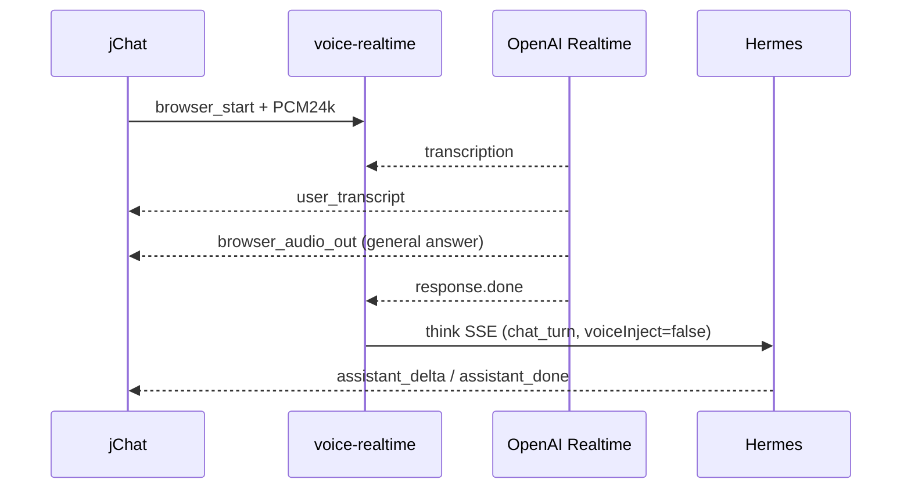
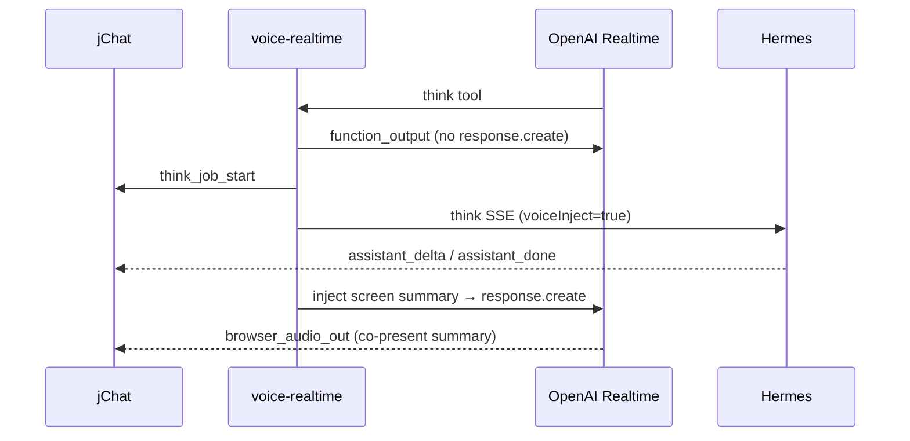
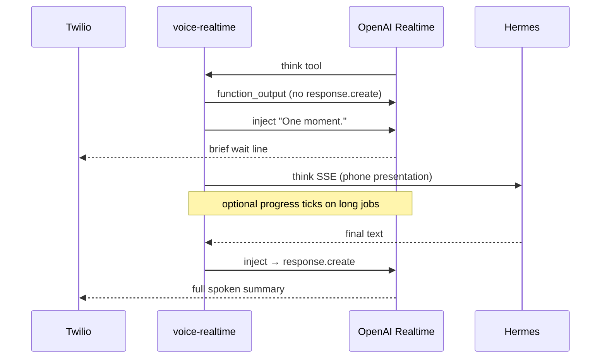

# Voice: when to think vs what to say

Joshu voice uses **OpenAI Realtime S2S** (`packages/voice-realtime`) for all speech — phone (Twilio) and browser (jChat / jMail). Two decisions happen on every turn:

| Concern | Question | Primary decider |
| --- | --- | --- |
| **A. When to think** | Should Hermes (the brain) run? | OpenAI Realtime — via the `think` tool + session orchestration |
| **B. What to say** | What does the user hear? | OpenAI Realtime audio — scripted by Realtime itself or by injected Hermes results |

See also [voice-realtime.md](voice-realtime.md) (service architecture), [web-voice.md](web-voice.md) (browser wiring), [joshu-identity.md](../joshu-identity.md) (persona).

## Actors



- **Realtime** — live speech-to-speech model (`gpt-realtime-2`). Handles VAD, transcription, casual replies, and spoken output.
- **Brain (Hermes)** — files (gbrain MCP), Hindsight memory, tools, writes. Invoked via `runJoshuThink()` in [`brainThink.ts`](../../packages/voice-realtime/src/brainThink.ts).
- **Orchestration** — [`twilioRealtimeSession.ts`](../../packages/voice-realtime/src/twilioRealtimeSession.ts) (phone) and [`browserRealtimeSession.ts`](../../packages/voice-realtime/src/browserRealtimeSession.ts) (browser) connect Realtime events to Hermes jobs and speech injects.

The `think` tool is registered in [`realtimeTools.ts`](../../packages/voice-realtime/src/realtimeTools.ts). Realtime is instructed (via system prompt) to call it for **this user's** files, memory, desktop, and personal tasks — **not** for general world knowledge it already knows.

---

## Realtime vs brain (desktop / files)

Two layers — easy to confuse in conversation:

| Layer | Sees desktop? | Role |
| --- | --- | --- |
| **OpenAI Realtime** (voice) | No direct filesystem view | Hear/speak, call `think`, read injected results |
| **Hermes** (`think` → gbrain, tools) | Yes (ArozOS Desktop, `joshu's files`, etc.) | Actual file/memory/work |

On a **phone call**, Realtime is literally blind to the desktop. A common failure mode is the model **saying** it has no access (or giving a generic intro), then **still** calling `think` in the same `response.done` — the user hears a refusal, then “checking…”, then the real answer.

**Mitigations (code + prompts):**

- Phone system prompt — [`buildVoiceSystemPrompt(..., "phone")`](../../packages/voice-realtime/src/joshuIdentity.ts): call `think` immediately on personal tasks; never apologize for lacking access; the tool **is** desktop access.
- `think` tool description — [`realtimeTools.ts`](../../packages/voice-realtime/src/realtimeTools.ts): zero spoken preamble; do not claim you lack access.
- Phone handler — after `think`, `sendFunctionOutput` with `triggerResponse: false`, then a single `injectProgressMessage("One moment.")` (Joshu speaks the wait line, not an extra model ack from tool JSON).
- Detection — [`twilioRealtimeSession.ts`](../../packages/voice-realtime/src/twilioRealtimeSession.ts) logs `ANTIPATTERN spoke-before-think` when audio + `think` share one response (regex `LIMITATION_DENIAL_RE` flags likely denials).

**Local grep:**

```bash
grep 'ANTIPATTERN spoke-before-think\|THINK START'   # dev logs
```

If the first desktop question still gets a wrong spoken line, check whether `think` was invoked on that turn (`tool invoke think`) or only on a **follow-up** utterance after barge-in.

---

## A. When to think

### Who decides

**OpenAI Realtime** chooses whether to call `think`, guided by:

- System prompt — [`buildVoiceSystemPrompt()`](../../packages/voice-realtime/src/joshuIdentity.ts) (`web` vs `phone` surface)
- Tool description — personal/user work only
- Conversation context — Realtime passes `intent`, `summary`, optional `user_quote`

Joshu code does **not** regex-classify utterances. It reacts to Realtime's tool call. On browser, casual turns sync S2S speech to the attached surface without invoking Hermes.

### Phone — Hermes only when Realtime calls `think`

```
User speaks → Realtime transcribes
           → Realtime answers directly  OR  calls think
           → if think: runJoshuThink(presentation: "phone")
           → if no think: no Hermes at all
```

Transcripts update a local turn log for context; they **never** start Hermes on their own.

### Phone — who triggers the next Realtime response

PSTN uses **server VAD** by default (`VOICE_PHONE_VAD_SILENCE_MS=500`) with **`create_response: false`** ([`PHONE_VAD`](../../packages/voice-realtime/src/twilioRealtimeSession.ts)): short silence ends the turn, then Joshu waits for transcript and calls `requestOrganicResponse()`. Optional **`semantic_vad`** — use `VOICE_PHONE_VAD_EAGERNESS=high` for latency (`low` waits longer). Logs include `transcriptAfterSpeechStopMs` per turn.

| Transcript ([`userInputGate.ts`](../../packages/voice-realtime/src/userInputGate.ts)) | Action |
| --- | --- |
| `empty` | Ignore (VAD only) |
| `unclear` | `injectRepromptMessage()` — ask to repeat |
| `clear` | Log `turn #N USER → …`, append transcript, `requestOrganicResponse()` |

Unexpected **organic** `response.create` while Joshu did not initiate speech is **cancelled** (echo/noise guard). Turn-level logs: `turn #N`, `resp #M`, `SPEECH START` / `SPEECH OUT source=…`.

### Phone — think passphrase (PSTN only)

When `TWILIO_THINK_PASSWORD` is set, **Joshu** gates Hermes — not just the Realtime prompt:

```
User speaks → transcript
           → if passphrase heard (fuzzy): unlock, disable session timers, maybe ask to restate intent
           → if Realtime calls think while locked: function_output denied + injectControlMessage
           → if unlocked: normal think → Hermes
```

| Concern | Detail |
| --- | --- |
| **General knowledge** | Still allowed without passphrase (Realtime organic response) |
| **Personal / files / desktop** | Requires unlock; server blocks `think` until then |
| **STT tolerance** | [`phonePassphrase.ts`](../../packages/voice-realtime/src/phonePassphrase.ts) — apostrophe normalization, compact-string similarity, per-token fuzzy match |
| **Unlock sources** | User transcript, or `think` args (`user_quote`, `summary`) + prior transcript lines |
| **Secrets in Hermes** | Passphrase redacted from think context; never treated as a task command |
| **After passphrase-only unlock** | User must restate intent unless a task-like phrase is already in the call transcript |

Full call UX (greeting, 60s/90s timers, owner caller): [voice-realtime.md — Phone security and call UX](voice-realtime.md#phone-security-and-call-ux-pstn-only).

### Browser — S2S for casual speech; Hermes only on `think`

Two paths, **one outcome per spoken turn** (deduped in `browserRealtimeSession.ts`):

| Situation | Hermes (brain) | Surface (jChat today) | Voice |
| --- | --- | --- | --- |
| S2S answers casually (no `think`) | **Not invoked** | S2S output transcription (`assistant_delta` / `assistant_done`) | S2S organic speech |
| S2S calls `open_desktop` | **Not invoked** | `desktop_action` → opens app/file silently | S2S may speak briefly |
| S2S calls `think` | On tool call | Full brain stream via `assistant_delta` / `assistant_done` | Brief phrase + co-present summary after inject |

Casual example: *"How are you?"* — S2S speaks; jChat shows what S2S said. No duplicate Hermes paragraph.

Deep-work example: *"List folders on my desktop"* — S2S calls `think`; Hermes runs with Realtime's `intent`/`summary`; surface gets the full streamed answer; voice gets a short co-present summary after inject.

Dedup rules (avoid double Langfuse traces):

| Event | Action |
| --- | --- |
| User transcript arrives | Store quote; arm organic surface sync — do not start brain yet |
| Realtime `response.done` + `think` | Start (or upgrade) one brain job; `voiceInject=true` |
| Realtime `response.done`, no `think` | Finalize organic surface sync from S2S transcription |
| Late transcript after `think` already started | Skip — same utterance |

Surface wire events live in [`voiceSurfaceSync.ts`](../../packages/voice-realtime/src/voiceSurfaceSync.ts) — jChat consumes them today; future desktop shells can subscribe the same protocol.

Hermes session key: `voice-think:{surfaceSessionId}:{jobId}`.

---

## B. What to say (voice output)

All audible output is **OpenAI Realtime audio**. The question is who writes the script.

### Three ways Realtime is asked to speak

Implemented in [`openaiRealtimeClient.ts`](../../packages/voice-realtime/src/openaiRealtimeClient.ts):

| Trigger | Mechanism | Typical use |
| --- | --- | --- |
| **Organic** | `requestOrganicResponse()` (phone) or Realtime auto (browser) | General knowledge, casual replies |
| **Call control** | `injectControlMessage()` → `response.create` | Phone greeting, passphrase prompts, session timeout (exact short line) |
| **After `think`** | `sendFunctionOutput` (`triggerResponse: false`) + `injectProgressMessage("One moment.")` on phone | One handler-owned wait line; avoids model hallucinating from tool JSON |
| **After brain completes** | `injectAssistantMessage()` → `response.create` | Hermes result → spoken summary |
| **During long jobs** | `injectProgressMessage()` | "Still checking.", etc. (phone + browser) |
| **Unclear audio (phone)** | `injectRepromptMessage()` | Ask caller to repeat |

Inject wording uses [`speechPresentation.ts`](../../packages/voice-realtime/src/speechPresentation.ts):

- **`screen`** (browser) — *"Full answer is on the user's screen — speak a brief co-present summary (1–3 sentences)."*
- **`voice_only`** (phone) — *"User has no screen — speak a clear, complete summary they can act on."*

Hermes itself uses different system prompts per surface (`buildThinkSystemPrompt(..., "screen" | "phone")` in `brainThink.ts`): markdown on screen, plain speakable text on phone.

### Phone — voice is the only output channel

| Turn type | What the user hears |
| --- | --- |
| General knowledge | Realtime speaks directly |
| `think` path | ① Handler injects **"One moment."** (no `response.create` on tool output) → ② optional progress ticks → ③ full actionable summary when Hermes finishes |

Phone handler ([`twilioRealtimeSession.ts`](../../packages/voice-realtime/src/twilioRealtimeSession.ts)):

```typescript
oa.sendFunctionOutput(call.callId, JSON.stringify({ status: "accepted", ... }), {
  triggerResponse: false,
});
oa.injectProgressMessage("One moment.");
```

The model must **not** speak in the same response as `think` (prompt + tool description). Letting Realtime `response.create` on raw function output tended to produce duplicate or contradictory acks.

When Hermes completes, the full phone-formatted answer is injected and Realtime speaks it.

### Browser — voice and screen are decoupled on `think` only

| Turn type | Surface (jChat today) | Voice |
| --- | --- | --- |
| Casual / general knowledge | S2S transcription (what you heard) | S2S organic speech |
| `think` path | Hermes full answer via `assistant_delta` | At most one brief phrase when calling `think`; co-present summary after inject |

Browser: the model may say one short line when invoking `think`; **no** second ack from tool output (`triggerResponse: false`):

```typescript
// browserRealtimeSession.ts
oa.sendFunctionOutput(call.callId, JSON.stringify({ status: "accepted", ... }), {
  triggerResponse: false,
});
```

Voice inject only when `voiceInject=true` (the `think` path). Organic turns update the surface from S2S transcription only — no parallel Hermes job.

---

## Side-by-side summary

| | **Phone** | **Browser** |
| --- | --- | --- |
| **A: When to think** | Only when Realtime calls `think` | Only when S2S calls `think` |
| **A: Hermes trigger** | Realtime tool call only | `think` tool call (or reconcile when `response.done` reports think) |
| **B: General knowledge speech** | Realtime only | S2S speaks; surface shows S2S transcript |
| **B: After `think` wait line** | Handler `injectProgressMessage("One moment.")`; tool output suppressed | Model may say one brief phrase when calling `think`; tool output suppressed |
| **B: After Hermes completes** | Full phone summary aloud | Brief co-present summary; full text on screen |
| **B: Hermes output mode** | `presentation: "phone"` | `presentation: "screen"` |

---

## End-to-end sequences

### Browser — general question (no `think`)



### Browser — personal question (`think`)



### Phone — personal question (`think`)



---

## Key source files

| File | Role |
| --- | --- |
| [`openaiRealtimeClient.ts`](../../packages/voice-realtime/src/openaiRealtimeClient.ts) | Realtime WS; tool output; inject + progress speech |
| [`realtimeTools.ts`](../../packages/voice-realtime/src/realtimeTools.ts) | `think` tool definition |
| [`brainThink.ts`](../../packages/voice-realtime/src/brainThink.ts) | Hermes SSE delegate |
| [`speechPresentation.ts`](../../packages/voice-realtime/src/speechPresentation.ts) | Inject wording (screen vs voice_only) |
| [`joshuIdentity.ts`](../../packages/voice-realtime/src/joshuIdentity.ts) | Realtime + think system prompts |
| [`twilioRealtimeSession.ts`](../../packages/voice-realtime/src/twilioRealtimeSession.ts) | Phone orchestration |
| [`browserRealtimeSession.ts`](../../packages/voice-realtime/src/browserRealtimeSession.ts) | Browser orchestration + chat sync |
| [`userInputGate.ts`](../../packages/voice-realtime/src/userInputGate.ts) | PSTN transcript classify (clear / unclear / empty) |
| [`phonePassphrase.ts`](../../packages/voice-realtime/src/phonePassphrase.ts) | Phone think-passphrase fuzzy match |

---

## Avoiding duplicate spoken acknowledgments

**Symptom:** User hears two “I’m looking that up” lines (or a denial plus a check).

**Causes:**

| Surface | Typical cause |
| --- | --- |
| **Phone (older)** | System prompt told the model to say “I’m thinking” **and** `sendFunctionOutput` triggered `response.create` on tool JSON |
| **Phone (current)** | Model speaks a denial or preamble **in the same turn** as `think` — grep `ANTIPATTERN spoke-before-think` |
| **Browser** | Model brief phrase at `think` + (historically) second ack from tool output — browser uses `triggerResponse: false` |

**Current policy:**

- **Phone:** Model silent on the `think` turn; Joshu injects **one** “One moment.”; progress ticks only after that finishes.
- **Browser:** At most **one** short phrase when calling `think`; no second ack from tool output.

---

## OpenAI Platform observability

Joshu uses a **direct WebSocket** to `wss://api.openai.com/v1/realtime?model=…` ([`openaiRealtimeClient.ts`](../../packages/voice-realtime/src/openaiRealtimeClient.ts)). That traffic is **not** the same as `POST /v1/chat/completions`.

| Where you look | What you see |
| --- | --- |
| [platform.openai.com/logs](https://platform.openai.com/logs) (Chat Completions / Responses) | Usually **no** per-turn Realtime session rows |
| [Organization usage](https://platform.openai.com/settings/organization/usage) | Spend / activity for **`gpt-realtime-2`**, often under **audio** — filter **All projects**, today (UTC) |
| **Langfuse** (if enabled for Hermes) | **`think` / Hermes jobs only** — not OpenAI Realtime audio |
| **Local `[voice-realtime]` logs** | Best trace for voice: `openai session ready`, `THINK START`, `speech-instruct`, `ANTIPATTERN` |

**API key** resolved in [`config.ts`](../../packages/voice-realtime/src/config.ts): `OPENAI_API_KEY` → `VOICE_TOOLS_OPENAI_KEY` → `HINDSIGHT_API_LLM_API_KEY`. Env load order ([`loadEnv.ts`](../../packages/voice-realtime/src/loadEnv.ts)): repo `.env` → `.env.twilio.local` → `~/.hermes/.env` (**last wins**). `dev-arozos` exports only `OPENAI_API_KEY` / `VOICE_TOOLS_OPENAI_KEY`. If usage is missing in the dashboard org you expect, confirm the key on the call matches that org/project.

`TWILIO_PHONE_SYSTEM_PROMPT` **replaces** the built-in phone prompt entirely when set — keep the desktop-access and no-preamble rules if you override.

Verbose OpenAI events: `VOICE_REALTIME_DEBUG=true`. See [voice-realtime.md — Logging](voice-realtime.md#logging).
